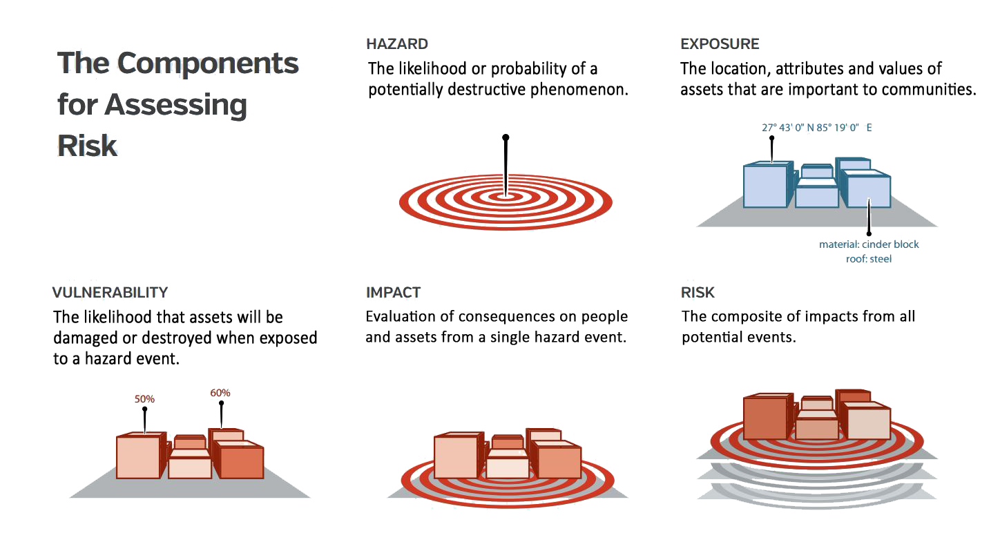

<!-- https://hackmd.io/VGiOi2NmQDS2Eu9jgUGNwQ -->

# Key concepts

In this section, you will find definition of key concepts behind the RDLS including what is a disaster, how to reduce disaster risk through disaster disaster risk management and disaster risk assessment and what are the different types of risk data needed.

Main definitions are taken from the [UNDRR Terminology](https://www.undrr.org/terminology). 

## Disaster risk

Disaster risk is the potential loss of life, injury, or destroyed or damaged assets which could occur to a system, society or a community in a specific period of time, determined probabilistically as a function of hazard, exposure, vulnerability and coping capacity.

Disaster risk comprises different types of potential impacts and losses (direct and indirect, tangible and intangible) which are sometimes difficult to quantify. Nevertheless, with knowledge of the prevailing hazards, the patterns of population and socio-economic development and their tendency to suffer impacts, disaster risks can be assessed and mapped, at least in broad terms.

Source: [Disaster Risk, UNDRR Terminology](https://www.undrr.org/terminology/disaster-risk)

## Disaster risk management

Disaster risk management is the application of disaster risk reduction policies and strategies to prevent new disaster risk, reduce existing disaster risk and manage residual risk, contributing to the strengthening of resilience and reduction of disaster losses.

Source: [Disaster Risk Management, UNDRR Terminology](https://www.undrr.org/terminology/disaster-risk-management)

## Disaster risk assessment

A qualitative or quantitative approach to determine the nature and extent of disaster risk by analysing potential hazards and evaluating existing conditions of exposure and vulnerability that together could harm people, property, services, livelihoods and the environment on which they depend.

Source: [Disaster Risk Assessment, UNDRR Terminology](https://www.undrr.org/terminology/disaster-risk-assessment)

## Disaster risk information (risk data)

Comprehensive information on all dimensions of disaster risk, including hazards, exposure, vulnerability and capacity, related to persons, communities, organizations and countries and their assets.

Disaster risk information also includes the results of disaster risk assessments often expressed in terms of potential losses or impacts.

Source: [Disaster Risk Information, UNDRR Terminology](https://www.undrr.org/terminology/disaster-risk-information)

<!--
(adapted from "[Understanding risk in an evolving world, World Bank, 2014](https://openknowledge.worldbank.org/handle/10986/20682)")-->

## Hazard

An hazard is a process or phenomenon that may cause loss of life, injury or other health impacts, property damage, social and economic disruption or environmental degradation.  Hazards may be single, sequential or combined in their origin and effects. Each hazard is characterized by its location, intensity or magnitude, frequency and probability. An hazardous event is the manifestation of a hazard in a particular place during a particular period of time.

Hazards can have natural or anthropogenic origin. Natural hazards are associated with natural processes and phenomena (geological, geophysical and hydrometeorological).

Source: Source: [Hazard, UNDRR Terminology](https://www.undrr.org/terminology/hazard)

## Exposure

The situation of people, infrastructure, housing, production capacities and other tangible human assets located in hazard-prone areas. Measures of exposure can include the number of people or types of assets in an area. These can be combined with the specific vulnerability and capacity of the exposed elements to any particular hazard to estimate the quantitative risks associated with that hazard in the area of interest

Source: [Exposure, UNDRR Terminology](https://www.undrr.org/terminology/exposure)

## Vulnerability
Vulnerability are the conditions determined by physical, social, economic and environmental factors or processes which increase the susceptibility of an individual, a community, assets or systems to the impacts of hazards. The inverse of vulnerability is defined coping capacity, which is the combination of all the strengths, attributes and resources available within an organization, community or society to manage and reduce disaster risks and strengthen resilience.

Source: [Vulnerability, UNDRR Terminology](https://www.undrr.org/terminology/vulnerability)

## Cat model

Catastrophe risk models (cat models) are common tools used to assess natural disaster risk. The models typically have four components: hazard, exposure, vulnerability and loss.

A subset of a catastrophe risk model is an impact model, which is essentially a risk model that can only be used deterministically. The impact model uses hypothetical or historical events to simulate “what-if” scenarios that are often used as an aid for disaster planning and management. An example of an impact modeling tool is InaSAFE.

Source: [GFDRR, Solving the Puzzle, 2016](https://www.gfdrr.org/sites/default/files/solving-the-puzzle-report.pdf)

## Examples of risk data

The four components of risk assessment are showcased below for an assessment of flood risk over tangible asset in the urban area of Kabul (Afghanistan).

<table><tr>
<td align="center" width=50% bgcolor="#0b3860"><b>Hazard: map of flood water depth</b></td>
<td align="center" width=50% bgcolor="#0b3860"><b>Exposure: buildings footprints and population</b></td></tr>
<tr><td></td><td></td></tr>
<tr>
<td align="center" width=50% bgcolor="#0b3860"><b>Vulnerability: depth-damage function</b></td>
<td align="center" width=50% bgcolor="#0b3860"><b>Impacts and losses: USD costs of replacement</b></td></tr>
<tr><td></td><td></td></tr>
</table>