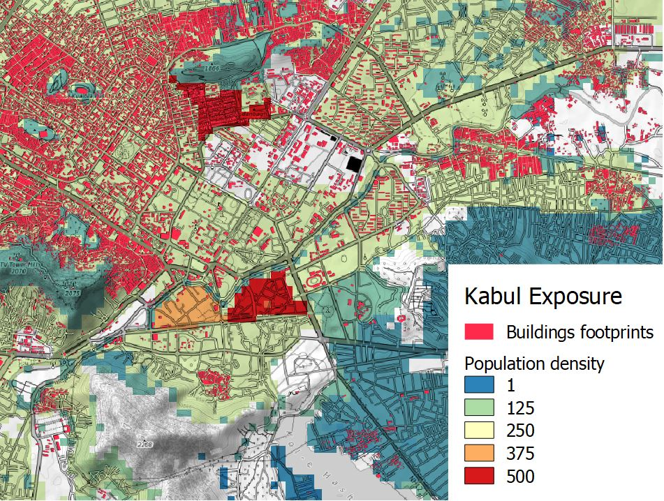
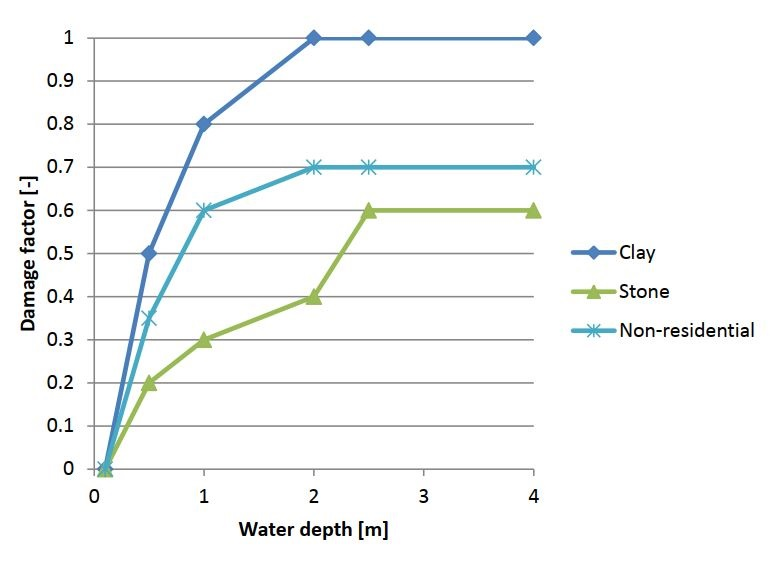

<!-- https://hackmd.io/VGiOi2NmQDS2Eu9jgUGNwQ -->

# Glossary

In this section, you will find definition of key concepts behind the RDLS including what is a disaster, how to reduce disaster risk through disaster disaster risk management and disaster risk assessment and what are the different types of risk data needed.

## Disaster risk

Disaster risk is the potential loss of life, injury, or destroyed or damaged assets which could occur to a system, society or a community in a specific period of time, determined probabilistically as a function of hazard, exposure, vulnerability and coping capacity.

Disaster risk comprises different types of potential impacts and losses (direct and indirect, tangible and intangible) which are sometimes difficult to quantify. Nevertheless, with knowledge of the prevailing hazards, the patterns of population and socio-economic development and their tendency to suffer impacts, disaster risks can be assessed and mapped, at least in broad terms.

Source: [UNDRR Terminology (Disaster Risk)](https://www.undrr.org/terminology/disaster-risk)

## Disaster risk assessment

A qualitative or quantitative approach to determine the nature and extent of disaster risk by analysing potential hazards and evaluating existing conditions of exposure and vulnerability that together could harm people, property, services, livelihoods and the environment on which they depend.

Source: [UNDRR Terminology (Disaster Risk Assessment)](https://www.undrr.org/terminology/disaster-risk-assessment)

```{card} Risk assessment framework, adapted from [Understanding risk in an evolving world, World Bank, 2014](https://openknowledge.worldbank.org/handle/10986/20682)

```

## Disaster risk information (risk data)

Comprehensive information on all dimensions of disaster risk, including hazards, exposure, vulnerability and capacity, related to persons, communities, organizations and countries and their assets. Disaster risk information includes all studies, information and mapping required to understand the disaster risk drivers and underlying risk factors.

Source: [UNDRR Terminology (Disaster Risk Information)](https://www.undrr.org/terminology/disaster-risk-information)

## Disaster risk management

Disaster risk management is the application of disaster risk reduction policies and strategies to prevent new disaster risk, reduce existing disaster risk and manage residual risk, contributing to the strengthening of resilience and reduction of disaster losses.

Source: [UNDRR Terminology (Disaster Risk Management)](https://www.undrr.org/terminology/disaster-risk-management)

## Exposure

The situation of people, infrastructure, housing, production capacities and other tangible human assets located in hazard-prone areas. Measures of exposure can include the number of people or types of assets in an area. These can be combined with the specific vulnerability and capacity of the exposed elements to any particular hazard to estimate the quantitative risks associated with that hazard in the area of interest

Source: [UNDRR Terminology (Exposure)](https://www.undrr.org/terminology/exposure)

```{card} Exposure: buildings footprints and population

```

## Hazard

A hazard is a process or phenomenon that may cause loss of life, injury or other health impacts, property damage, social and economic disruption or environmental degradation.  Hazards may be single, sequential or combined in their origin and effects. Each hazard is characterized by its location, intensity or magnitude, frequency and probability. An hazardous event is the manifestation of a hazard in a particular place during a particular period of time.

Hazards can have natural or anthropogenic origin. Natural hazards are associated with natural processes and phenomena (geological, geophysical and hydrometeorological).

Source: [UNDRR Terminology (Hazard)](https://www.undrr.org/terminology/hazard)

```{card} Hazard: map of flood water depth

```

## Impact model

An impact model (also damage model; loss model) is used to combine Hazard, Exposure and Vulnerability components to calculate the amount of value that is expected to be impacted (damaged or lost).

Source: [GFDRR, Solving the Puzzle, 2016](https://www.gfdrr.org/sites/default/files/solving-the-puzzle-report.pdf)

```{card} Impacts and losses: USD costs of replacement

```

## Vulnerability

Vulnerability are the conditions determined by physical, social, economic and environmental factors or processes which increase the susceptibility of an individual, a community, assets or systems to the impacts of hazards. The inverse of vulnerability is defined coping capacity, which is the combination of all the strengths, attributes and resources available within an organization, community or society to manage and reduce disaster risks and strengthen resilience.

Source: [UNDRR Terminology (Vulnerability)](https://www.undrr.org/terminology/vulnerability)

```{card} Vulnerability: depth-damage function

```
