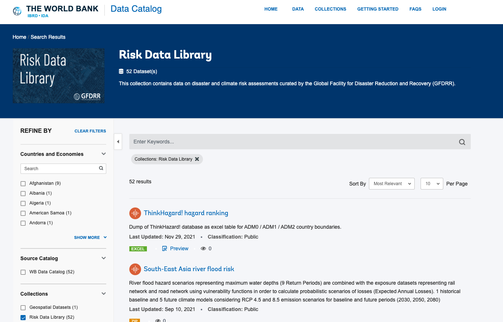
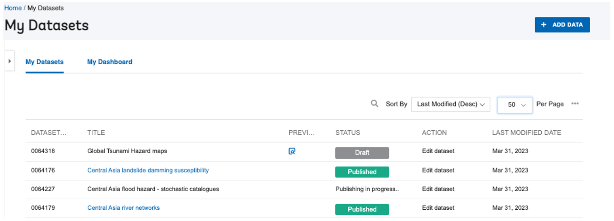
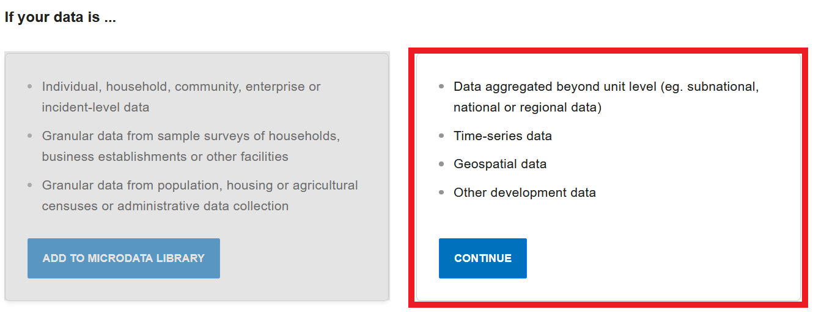
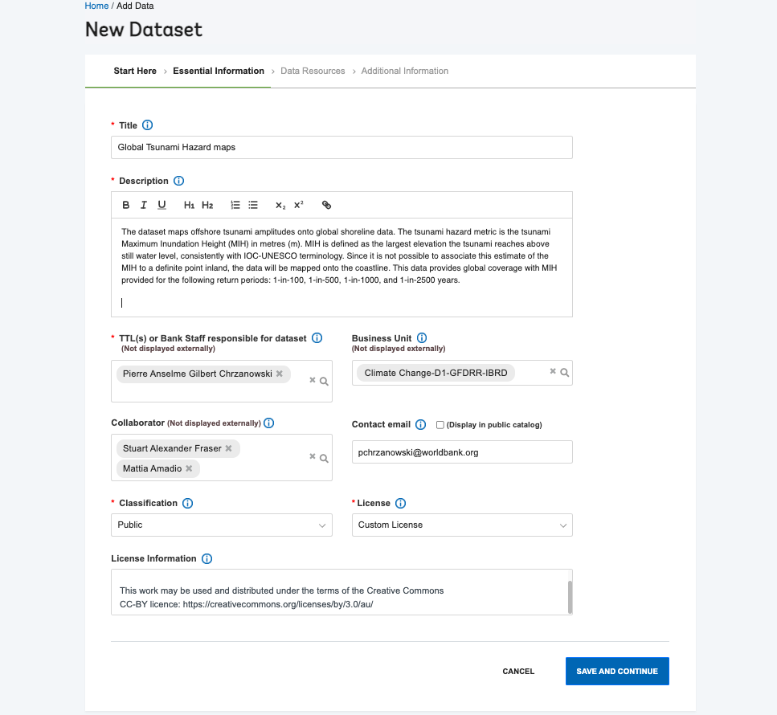
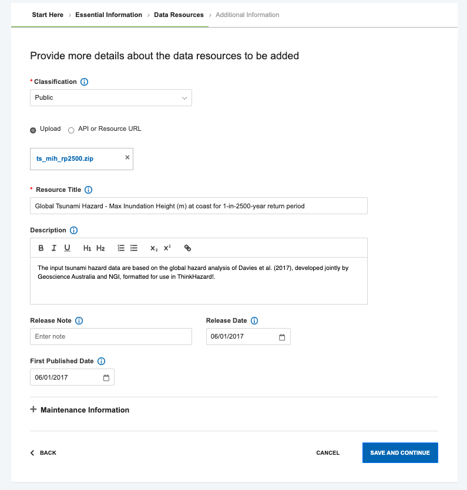
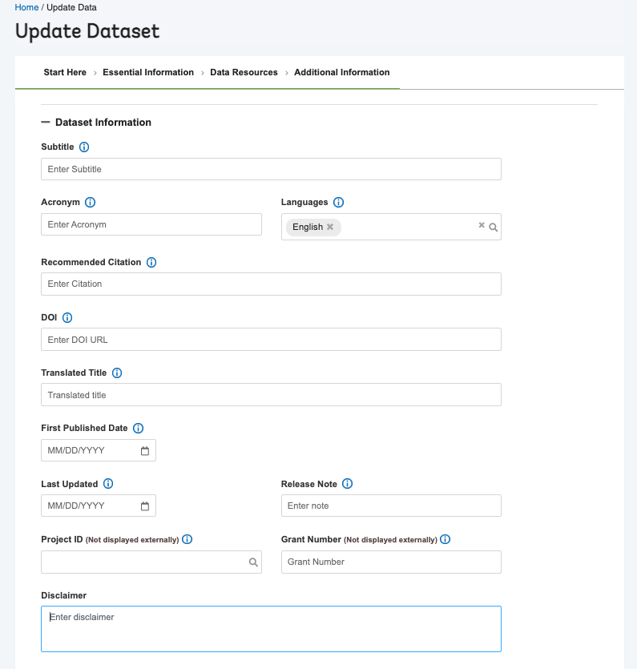
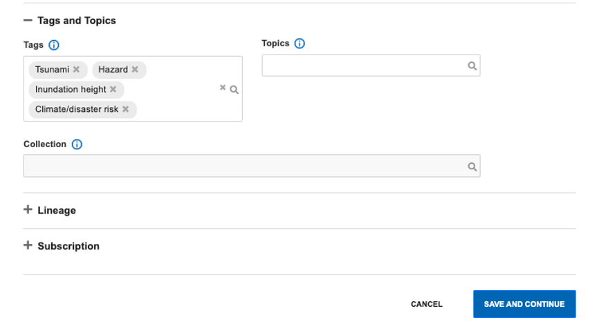

# RDL collection

The [Risk Data Library Collection](https://datacatalog.worldbank.org/search/collections/Risk-Data-Library) sits within the [World Bank Data Catalog](https://datacatalog.worldbank.org) and is meant to store standard risk data.
The collection can be accessed from the [collections page](https://datacatalog.worldbank.org/search/collections/) or used as a filter on the left bar to search for data within the collection.

## Add datasets
Datasets can be submitted for review and publication on the Data Catalog by any World Bank Staff, ETC or STC. These people have the role of `Data depositor`. 
Datasets needs to be packaged according to the [**data preparation guidelines**](preparation.md). 
 
Two options to upload data:
- **Individually**: using the upload wizard
- **Bulk**: for large number of datasets, requires support by the [DDH team](#ddh-team)

In both cases, datasets can be added to the [RDL Collection](https://datacatalog.worldbank.org/search/collections/Risk-Data-Library) only by the [RDL team](#rdl-team), after approval.

### Individual datasets
- Log in to the [Data Catalog](https://datacatalog.worldbank.org/int/home) (top right bar)
- View [My datasets](https://datacatalog.worldbank.org/int/data/mydata) (top right bar)
  
  The page shows dataset number, name, modified date, status (Published, Draft, Under review, Publishing in progress) for datasets you have uploaded or for which you are listed as a contributor
  - Under `Action` you can `edit` or `submit for review` to the [DDH team](#ddh-team).
  - When status is `Published`, the dataset will be visible on the World Bank Data Catalog.
- Click [Add data](https://datacatalog.worldbank.org/int/data/add) (top right bar)
Select the option on the right: _`continue`_.

  1. **Essential Information**
    

  2. **Data Resources**
  - Upload dataset from your local storage
  - Add a resource title and description
  - When one resource has been submitted, another one can be added
    

  3. **Additional information**
    
  - **Tags**: These are important for being able to search the data in the catalog. Suggestions for RDLS data:
    - Climate Risk or Disaster Risk
    - Hazard, Exposure, Vulnerability, Loss (depending on the component type)
    - Flood, Earthquake, Landslide, Tsunami (hazard type)
  - **Topics**: There is currently no topic for risk analytics or climate and disaster risk - leave blank
  - **Collection**: this can only be entered by staff with those rights. Provide a list of dataset ID to [Kamwoo Lee](#ddh-team) with request to assign data to RDL Colelction.
  

When all required (and optional) information has been entered, click on `Save as draft`. The dataset will appear under `My datasets` list.

### Bulk upload
In cases where large volumes of project data should be uploaded, DDH team can assist with bulk upload. 
The workflow steps are:
1. Store project data in folders on OneDrive.
2. Create an excel spreadsheet describing the datatype with each dataset name, URL to data and URL to prepared JSON metadata. 
3. Describe the data structure to be achieved on DDH.
4. DDH team will copy the data and metadata to DDH Sharepoint.
5. DDH team will use scripts to upload datasets; these will appear in your `My Datasets` for review and any further editing.

## RDL metadata
- Create metadata following to Risk Data Library schema in JSON format. Metadata should be created for each dataset, and includes the description and name of resources under that dataset. Either:
  1. Write directly into JSON file
  2. Use JSON metadata creation tool. This tool is standalone (not part of DDH). It exports a JSON file to be saved with the dataset.
- Upload metadata with the dataset. Metadata will become available to download from the dataset page. This will contain the standard DDH metadata plus the RDL metadata.

## Contacts
### RDL Team
- Mattia Amadio <[mamadio@worldbank.org](mailto:mamadio@worldbank.org)>
- Stuart Fraser <[sfraser@worldbank.org](mailto:sfraser@worldbank.org)>
- Pierre Chrzanowski <[pchrzanowski@worldbank.org](mailto:pchrzanowski@worldbank.org)>

### DDH Team
- Kamwoo Lee <[klee16@worldbank.org](mailto:klee16@worldbank.org)>
- Gaurav Bhardwaj <[gbhardwaj1@worldbank.org](mailto:gbhardwaj1@worldbank.org)>
- Rochelle O’Hagan <[rohagan@worldbank.org](mailto:rohagan@worldbank.org)> (DDH lead)

DDH team is responsible for review and publication of submitted datasets, and to assign datasets to RDL collection.

