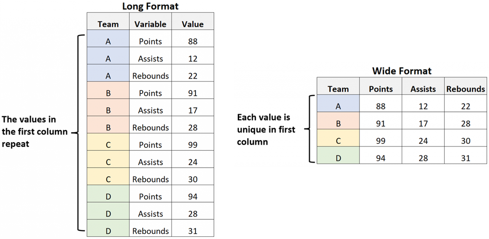

# Data formats

Risk data can be made of spatial or non-spatial data.

- **Spatial data (geodata)** can be shared in a variety of formats depending on the software used by the analyst. Over the years, [OSGEO ](https://wiki.osgeo.org/wiki/Main_Page) (Open Source Geospatial Foundation) tried to converge towards a limited number of "best" standard formats for each geospatial type.
  <br><br>
- **Non-spatial data** most often consist of table data stored as `.xlsx` or ``.csv` files for greater compatibility.

Below is a list of recommended and supported geodata formats.

## Recommended geodata formats

### Vector data: GeoPackage

**GeoPackage** (`.gpkg`) is an open, non-proprietary SQLite3 extended Database container. It is platform-independent and standards-based (OGC, QGIS, GDAL). Similar to ESRI geodatabase, but more responsive. It is a single-file format that can store anything from vector data and attributes, symbology, pyramids, table data as individual layers within one geopackage. It is possible to store rasters, but its supports for raster data is still limited and we don't recommend storing those as geopackage. Supports SQL and API to DB - fit for web applications, can export to PostGIS. There is no limit of attributes, attribute name size, or file size (unlike shapefile, `.shp`). Internal metadata specifications are under development.

```{note}
Always prefer WIDE geodatabase table formatting instead of LONG format when working in GIS environment; by duplicating vector rows, the geospatial information is also duplicated, which cause the size of the data to increase exponentially, and slows down the spatial processing.

```

### Raster data: GeoTIFF / COG (`.tif`)

**GeoTIFF** (`.tif`) is the image standard file for GIS and satellite remote sensing applications. It can store multiple realisations as “bands”. GeoTIFFs can be accompanied by other auxiliary files (`.tfw` for raster geolocation, `.xml` for metadata, `.aux` for projections and others, `.ovr` for pyramids to improve visualisation), compressed into a `.zip` file together with the `.tif` files for sharing.

**A Cloud Optimized GeoTIFF (COG)** is a regular GeoTIFF file, aimed at being hosted on a HTTP file server, with an internal organization that enables more efficient workflows on the cloud. It does this by leveraging the ability of clients issuing ​[HTTP GET range requests](https://tools.ietf.org/html/rfc7233) to ask for just the parts of a file they need. This is the best option for data that needs to be hosted on a geocatalogue such as [GeoNode](https://www.geonode-gfdrrlab.org).

## Supported geodata formats

### Vector data

**ESRI ShapeFile** (`.shp`) is a well established, de facto standard in the GIS community. Accepted by all GIS software. Format specifications are open, however it is a proprietary format (controlled by Esri). It can only contains one geometry type (point, line, polygon) per file. It is a multiple-parts file format (`.shp` for geometry, `.dbf` for table, `.shx` for indexing, `.prj` for CRS, and other files for encoding, indexes, etc.). Attribute names are limited to 10 characters, and number of attributes (ie table fields) is limited to 255. The file size is restricted to 2 GB.

```{note}
Conversion from `.shp` to `.gpkg` is lossless and usually size-efficient. Where shp format is maintained, it is stongly suggested they are provided as a `.zip` folder containing the multiple components of the shapefile dataset (`.shp`, `.dbf`, `.xml`, `.ovr`, etc.).
```

### Raster data

**Network Common Data Form (NetCDF)** (`.nc`) is a format for storing multi-dimensional, array-oriented variables. Commonly used in the scientific community for multidimensional geodata storage (e.g., climate data). Supported by ArcGIS and QGIS via toolbox conversion or extensions; most spatial processing tools require conversion into raster first.

**GRIdded Binary or General Regularly-distributed Information in Binary (GRIB)** is standardized by the WMO and in operation since 1985. Similar to NetCDF, GRIB files are commonly used in meteorology to store historical and forecast weather data. It’s a multidimensional file with the advantages of self-description, flexibility and expandability. There are tools to convert GRIB into rasters such as grb2grid and QGIS software.

## Non-spatial formats

### Spreadsheet and tables

**Comma-separated values** (`.csv`) is used for table data such as vulnerability models, results summary, aggregations, etc. Deprecated for grid spatial data. Small files can be added uncompressed, so the resource filetype will show as ‘CSV’. Where large or multiple files are compressed, filetype will show as ‘ZIP’ though so please include reference to the `.csv` filetype in the resource description.

**Excel** (`.xlsx`) is used for table data such as results summary, aggregations, etc. Deprecated for grid spatial data. Small files can be added uncompressed, multiple files ought to be compressed into a single `.zip` file, with reference to the `.xlsx` filetype in the resource description.

```{note}
Wide table formatting is preferred instead of long format.

```

### Documents

**Portable Document Format** (`.pdf`) is the preferred format for reports and documentation. Add reports uncompressed whenever possible: users will commonly want to see the description for each report or document as one resource per file. Resource filetype will show as ‘PDF’.

<hr>
