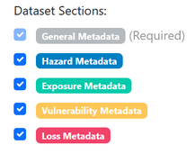

# Overview

This page provides an overview of the process for publishing Risk Data Library Standard (RDLS) metadata.

Before publishing RDLS metadata, you need to format, package and host your risk datasets so that they can be accessed. For more information, see [How to publish risk datasets](../datasets/index.md).

The process for publishing RDLS metadata can be divided into two phases:

* [Prepare your metadata](#prepare-your-metadata)  
* [Publish your metadata](#publish-your-metadata)

## Prepare your metadata

You should prepare your metadata in [Java Script Object Notation (JSON)](https://www.json.org/) format, which is the main metadata format used in data catalogues.

The recommended approach to prepare RDLS metadata is to use the [RDLS Metadata Editor](https://gfdrr.github.io/CCDR-tools/_static/RDL_MDE_v1.html), it offers input guidance, validation and export functionality.

It is *strongly suggested* that you do not author RDLS metadata in JSON format ‘by hand’ as doing so is time-consuming and error-prone. However, if you do choose this approach, you ought to use a text editor with support for JSON formatting and schema validation, such as [Visual Studio Code](https://code.visualstudio.com/docs/languages/json).

If you are exporting existing metadata from a data catalog or database, and you have access to a software developer, the suggested approach is to [develop a data pipeline](#develop-a-data-pipeline) to transform your metadata to RDLS format.

In either case, if your risk datasets use terms from existing taxonomies or classifications, use the [taxonomy mappings](../mappings/index.md) to identify the equivalent codes in RDLS.

If you are publishing an access-restricted resource, see [how to publish an access-restricted resource](how_to.md#publish-an-access-restricted-resource).

### Author metadata using the RDLS Metadata Editor

The [RDLS Metadata Editor](https://gfdrr.github.io/CCDR-tools/_static/RDL_MDE_v1.html) is a web-based tool for authoring RDLS metadata. It ensures that the metadata you enter is structured and formatted correctly, provides a live preview of the metadata in JSON format, and validates the metadata against the latest version of the [RDLS schema](../../reference/schema/index.md).

The graphic interface allows users to quickly select which risk components are covered by a dataset.

For each component selected, a color-coded tab is created. Each tab includes input forms that reflect the attributes of the component as described by the RDLS schema. Mandatory fields are marked in red and are checked by validation before publishing. Input types includes:

- open text fields, e.g. Title or Description  
- dropdown selectors from the standard closed codelists, e.g. Hazard type or Exposure category  
- open text field \+ dropdown suggestions from the standard open codelists, e.g. License

Components are designed to hold multiple items within the same dataset.  
‘Save Progress’ button allows to maintain the dataset content in the browser during an editing session, but it is advised to always ‘Export JSON’, using ‘Load Existing Metadata’ for later editing.

The ‘Validate Metadata’ button will show if there are mandatory fields that require to be fixed. Once validation is successful for all fields, the ‘Publish to RDL catalog’ button is enabled: it allows users to post their dataset in the [RDL catalog](https://catalog.riskdatalibrary.org/). See the [Publish your metadata](#publish-your-metadata) section.

### Develop a data pipeline

A data pipeline is a series of processing steps that transforms your existing metadata to RDLS format in bulk. It might be as simple as a Python script for a one-off transformation of simple metadata, or a scheduled pipeline created using [dlt](https://github.com/dlt-hub/dlt) and [dbt](https://github.com/dbt-labs/dbt-core) for periodic transformation of complex metadata.

If you plan to develop a data pipeline to transform existing metadata to RDLS format, you first need to identify how your existing metadata ‘maps’ to RDLS \- that is, identifying which [data elements](https://en.wikipedia.org/wiki/Data_element) within your metadata match which RDLS [fields](../../reference/schema/index.md) and [codes](../../reference/codelists.md). You then need to create a data pipeline that implements your mapping in code. To get help with creating a data pipeline, [contact the RDLS team](mailto:contact@riskdatalibrary.org).

You need to ensure that your data is structured and formatted correctly according to the [RDLS schema](../../reference/schema/index.md). Once you have prepared your RDLS metadata in JSON format, the next step is to validate it against the RDLS schema. You can validate individual files using the [Metadata Editor](https://gfdrr.github.io/CCDR-tools/_static/RDL_MDE_v1.html). Batch validation functionality is not yet available, but is on the development roadmap.

## Publish your metadata

The steps involved in publishing your RDLS metadata will depend on the specific data catalog or website to which you are adding your risk datasets.

* The [Risk Data Library Catalog](https://catalog.riskdatalibrary.org/) is the official RDL repository. Datasets can be published here directly from the [Metadata Editor](#author-metadata-using-the-rdls-metadata-editor). Note that this functionality requires a GitHub account.   
* The [World Bank Data Catalog](https://datacatalog.worldbank.org/) enables World Bank users to load custom metadata for a dataset. For more information, refer to the [internal guidance for World Bank users](https://github.com/GFDRR/rdl-standard/blob/1.0-dev/internal_guide_rdl_on_WBdataCatalog.md).  
* For any data catalog that does not natively support RDLS, attach your RDLS metadata as a custom metadata file.
