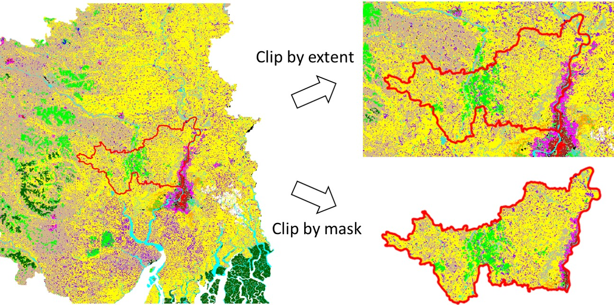

# Data packaging

The data structure and packaging of the output as obtained from the data analysts do not always align with the way we want users of the **Risk Data Library** to search and download data.

Datasets shared in risk catalogues (e.g. [Risk Data Library Collection](https://datacatalog.worldbank.org/search/collections/rdl) are provided as individual `RESOURCES`; it is encouraged to grouped these according to three main criteria:

- **GEOGRAPHY**: data covering a multi-country region might be split into individual countries' datasets.
- **THEME**: for risk data, this includes hazard, sector or asset type.
Depending on the project or intended purpose of the data, one or other grouping might be preferred. 

We also need to consider:
- **FORMAT**: how the data are stored. It is preferred to keep together data in the same format, conversely split different file formats in different resources. [**Read more**](formats) about supported data formats.
- **SELF-DEPENDENCY & COMPLETNESS**: the data resource can be interpreted and used by itself.
- **SIZE-EFFICIENCY**: try to avoid creating huge datasets (>1 Gb) that would be hard to download on poor connections.

```{caution}
In general, splitting raster datasets into smaller parts is not advised, according to self-dependency and completeness criteria. For data efficiency, always consider a larger extent than needed as to avoid cross-border artefacts. Instead of splitting rasters, consider storing the raster in an alternative format that maybe more size-efficient (see Formats sections).

```
Structuring risk data well when it is generated and before it is delivered to a client is important to ensure data folder are intuitive to search, and make dataset upload more efficient (and it is easier to do first time than changing the structure later). Decisions on how to structure risk data can be taken on a project-by-project basis, because there is a wide variety of how data are structured depending on the components of a project. For a country-scale analysis, we advise to follow the following structure of folders when preparing data for delivery / upload to a risk data catalog:

```
<country>_<project_name>
 ├── Hazard
 │   ├── <Hazard1> 	(example subfolders: hazard catalog, base data, hazard maps)
 │   └── <Hazard2>
 ├── Exposure
 │   ├── <Exposure1> 	(e.g., Residential buildings; Example subfolders: current exposure, projected exposure)
 │   └── <Exposure2>	(e.g., Transport infrastructure)
 ├── Vulnerability
 │   └── <Hazard1> X <Exposure1>
 │   └── <Hazard1> X <Exposure2>
 │   └── <Hazard2> X <Exposure1>
 │   └── <Hazard2> X <Exposure2>
 └── Loss
 │   ├── <Hazard1> X <Exposure1>	(subfolders for each sector loss; current and projected)
 │   └── <Hazard1> X <Exposure2>
 │   └── <Hazard2> X <Exposure1>
 │   └── <Hazard2> X <Exposure2>
```

```{caution}
Where there are many resources for a dataset, it can be tempting to include a folder structure in the online Data Catalog. This is not advised and it is suggested that `datasets` be grouped together into individual `Resources` in order to facilitate finding the specific component of analysis, and without creating problematically large file sizes.
```
<hr>

## Hazard data
### Format / data types
Hazard data typically include hazard maps representing one or more historical events, or simulated probabilistic scenarios (`event footprints`). In some cases, hazard curves and stochastic event set tables are provided. Additional data could include intensity-duration-frequency curves, ground motion relationships, or hazard-defence measures.<br>

Generally, hazard data (footprints) takes the form of raster (geo grid) data (`GeoTIFF / COG`), less often as vector data (`gpkg`, `shp`). Supporting data (hazard curves, historical catalogue) could come as tables (`csv`, `xlsx`) or vector data (`gpkg`, `shp`).

```{figure} ../img/hzd_tc.jpg
---
align: left
width: 98%
---
**Example:** two kinds of representation for the same hazard (tropical cyclones - strong winds) over the Caribbean:
<br>&nbsp;&nbsp;- **Raster** data (left): max wind speed from probabilistic scenario (Return Period 100 years);
<br>&nbsp;&nbsp;- **Vector** data (right): max wind speed from empirical events recorded in 40 years period (1980-2020).
```

### Thematic grouping
The main thematic groupings in hazard data are:
- **Hazard type**: data produced for seismic hazard, wildfire, fluvial flood, pluvial flood, etc.
- **Reference period**: e.g., historical, projections (2050, 2080)

### Geographic grouping
- **Scale, location and resolution**: Hazard data can be generated at global, regional, national, subnational, or urban level. High-resolution hazard data (e.g. urban level analysis) might be grouped for individual locations (city) whenever the dataset becomes too large.

### Packaging recommendation
We recommend grouping hazard data using the following hierarchy:
- **Hazard type**
  - *Geographic scale and location*
    - *Reference period*

For example:
```
<project_name>
 └── Hazard
     ├── <Hazard1>
     │  ├── <Country1>
     │  │  ├── <Historical>
     │  │  │  └── Dataset: <project_name>_<Hazard1>_<Country1>_<Historical>.zip  ->  [RP10.tif; RP25.tif; RP50.tif; RP100.tif]
     │  │  ├── <2050>
     │  │  │  └── Dataset: <project_name>_<Hazard1>_<Country1>_<2050>.zip  ->  [RP10.tif; RP25.tif; RP50.tif; RP100.tif]
     │  │  └── <2080>
     │  │     └── <...>
     │  └── <Country2>
     └── <Hazard2>
        ├── <...>
        └── <...>
```
<hr>
   
## Exposure data
### Format
Exposure dataset typically describe the location, characteristics and value of individual assets or an aggegrated number of assets/population per grid cell. Each point or cell usually has many attributes associated with it.

Exposure geospatial data can take the form of vector (`gpkg`, `shp`), or raster (`GeoTIFF / COG`). In some cases, exposure comes as table (`csv`, `xls`).

```{figure} ../img/exp_formats.jpg
---
align: left
width: 98%
---
**Example:** two kinds of exposure representation for the same area (Dhaka, Bangladesh):
<br>&nbsp;&nbsp;- **Raster** data (left): presence of built-up as binary raster layer at 10 meter resolution, derived from remote sensing (World Settlement Footprint 2019). Does not discriminate the building types;
<br>&nbsp;&nbsp;- **Vector** data (right): vector area of individual buildings from Open Street Map, 2023. Does discriminate between building types.
```

### Thematic grouping
The main thematic groupings in exposure data are:
- **Exposure category**: e.g. Population / Built-up / Cropland
- **Sub-type**: e.g. Built-up asset type (Structure, Content, Product) / sector (Residential, Commercial) / construction type (Masonry, Wood
                e.g. Population gender (male, female) / Age distribution (children; over 65)
- **Year**: reference period or year, e.g. specific year (2020), projected period (2040-2060), etc.

### Geographic grouping
- **Scale, location and resolution**: Exposure data can be generated at global, regional, national, subnational, or urban level. High-resolution hazard data (e.g. urban level) might be grouped for individual locations (city) whenever the dataset becomes too large.

### Packaging recommendation
We recommend grouping exposure data using the following hierarchy:
- **Geographic scale and location**
  - **Exposure category**
    - **Year**
      - *Sub-type* (optional) 

For example:
```
<project_name>
 └── Exposure
    ├── <Country1>
    │  ├── <Exposure_categoryl>
    │  │  ├── <2020>
    │  │  │  └── Dataset: <project_name>_<Hazard1>_<Country1>_<Exposure_categoryl>_<2020>.zip  ->  [subtype1.tif; subtype2.tif; subtype3.tif]
    │  │  └── <2050>
    │  │     └── Dataset: <project_name>_<Hazard1>_<Country1>_<Exposure_category1>_<2050>.zip  ->  [subtype1.tif; subtype2.tif; subtype3.tif]
    │  ├── <Exposure_category2>
    │  │  └── <...>
    └── <Country2>
        └── <Exposure2>
           └── <...>
```
<hr>

## Vulnerability data
### Format
Vulnerability data are usually provided as table data (`csv`, `xls`) or json containing the impact model function and parameters.

```{figure} https://gfdrr.github.io/CCDR-tools/_images/vln_fl_bu.png
---
align: center
width: 70%
---
Example of vulnerability functions for floods (depth-damage curve) as table data ([Download](https://publications.jrc.ec.europa.eu/repository/bitstream/JRC105688/copy_of_global_flood_depth-damage_functions__30102017.xlsx)).
```

Often, vulnerability models are proprietary data and only shared as pictures; this has low reusability and ought to be avoided. Always try to obtain a mathematical description for this component.

### Thematic grouping
The main thematic groupings specific to vulnerability data are:
<br>&nbsp;&nbsp;- **Hazard type**: e.g. Flood damage function; Earthquake fragility curves.
<br>&nbsp;&nbsp;- **Exposure type and sub-type*: e.g. Builtup (Structure, Content, Product / Residential, Commercial / Masonry, Wood)

### Geographic grouping
Vulnerability curves can be developed for individual countries or environments within a project. Where this is the case, this grouping ought to be retained.

### Packaging recommendation
We recommend to group exposure data  using the following hierarchy:
- **Hazard type**
  - *Geographic* (unless global function, one dataset per country)
    - **Exposure category** (Population, Built-up, ...)
      - **Sub-type** (e.g. sector (Residential, Commercial), construction type (Masonry, Wood), or others)

```{note}
This hierarchy can be maintained also when packing all the data in one file (e.g. multiple csvs into one excel file), which is advised _unless specifically demanded by the data use_ (e.g. data are formatted for usage into a specific model).
```

```{figure} ../img/vln_multi-table.jpg
---
align: left
width: 98%
---
Example of multiple vulnerability functions for floods (depth-damage curve) into one excel file ([Source: JRC](https://publications.jrc.ec.europa.eu/repository/bitstream/JRC105688/copy_of_global_flood_depth-damage_functions__30102017.xlsx)).
```
For example, when grouping multiple functions into one excel file, the following approach can be adopted:

```
<project_name>
 └── Vulnerability
    ├── <Hazard1>
    │  ├── <Country> (skip if global function)
    │  │  ├── <Exposure_category1>
    │  │  │  └── Dataset: <project_name>_<Hazard1>_<Country1>_<Exposure_categoryl>.xlsx  ->  [subtype1.tif; subtype2.tif; subtype3.tif]
    │  │  └── <Exposure_category2>
    │  │     └── Dataset: <project_name>_<Hazard1>_<Country1>_<Exposure_category2>.xlsx  ->  [subtype1.tif; subtype2.tif; subtype3.tif]
    └── <Hazard2>
        └── <...>
           └── <...>
```
<hr>

## Loss data
### Format
Loss data comes in the form of:
- tabulated event losses, and loss per exceedance probability
- Mapped return period loss / annual average loss - in vector files/choropleth maps
- (more rarely) as granular raster or vector data with loss value attached

### Thematic grouping
The main thematic groupings in loss data are:
- **Hazard type**: denoting a single hazard or a multi-hazard loss metric.
  - **Asset type / sector**: e.g. Structure, Content, Product / Residential, Commercial
    - **Year or period**: e.g. historical (2020), projections (2040-2060), etc.

### Geographic grouping
Losses are usually aggregated at national or subnational administrative level (ADM2, ADM1, or ADM0) or for a multi-country region.
Losses can also be provided per asset (e.g. individual buildings or raster footprints) but it is not usual, although these files are usually generated by the risk analysts.

### Packaging recommendation 
Strategy depends on the data format and size:
- if data consists of one or more table datasets, it is usually a good idea to group it together into one `excel` file so users can access all of the losses at once;
- if data consists of one or more vector datasets representing national or subnational boundary levels, these can be grouped into one `geopackage` file;
- if data consists of multiple granular spatial data, it might be packed as individual or multiple layers (depending on the size of individual layers)

In either case, we recommend grouping exposure data using the following hierarchy:
- **Hazard type**
  - *Country*
   - **Exposure category**
    - *Sub-type*
     - Year or period

For example:

```
<project_name>
 └── Loss
    ├── <Hazard1>
    │  ├── <Country> 	(skip if global function)
    │  │  ├── <Exposure_category1>
    │  │  │  └── Dataset: <project_name>_<Hazard1>_<Country1>_<Exposure_categoryl>.xlsx  ->  [subtype1.tif; subtype2.tif; subtype3.tif]; [period]
    │  │  └── <Exposure_category2>
    │  │     └── Dataset: <project_name>_<Hazard1>_<Country1>_<Exposure_category2>.xlsx  ->  [subtype1.tif; subtype2.tif; subtype3.tif]; [period]
    └── <Hazard2>
        └── <...>
           └── <...>
```
<br><hr>
