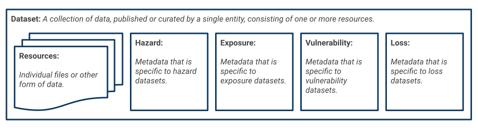

# What is the RDLS?

The Risk Data Library Standard (RDLS) is an open metadata standard for describing risk datasets used in climate and disaster risk assessments.

Metadata is data that provides information about a dataset. The RDLS covers metadata that can apply to any dataset, such as a dataset's title and author, and metadata that is specific to risk datasets, such as the type of hazard a dataset relates to.

RDLS defines risk-specific metadata for describing four types of dataset:

- **Hazard** datasets concern the processes or phenomena that might result in impacts such as loss of life, property damage and social and economic disruption. For example, the frequency and magnitude of earthquakes.

- **Exposure** datasets concern the situation of people, infrastructure and other tangible assets in hazard prone area. For example, the number of people living in an earthquake-affected area.

- **Vulnerability** datasets concern the susceptibility of exposed people and assets to the impacts of hazards. For example, the likelihood of buildings collapsing in the event of an earthquake.

- **Loss** datasets concern the damage caused when a hazard occurs. For example, the cost of repairing buildings damaged in an earthquake.

For more detailed definitions of these terms, refer to the [glossary](../glossary.md).

The [RDLS schema](../reference/schema.md) defines the meaning, structure and format of RDLS metadata. It defines the list of fields that can be used to describe risk datasets. RDLS metadata is structured as follows:



Metadata fields that are common to all resources are specified at the dataset level, whilst metadata fields that can vary by resource are specified at the resource level. Metadata fields that are specific to a particular type of risk data are specified at the dataset level and grouped under the relevant object: Hazard, Exposure, Vulnerability or Loss.

The schema specifies a title, description and data type for each field. The schema also specifies other rules to which RDLS metadata needs to conform, such as which fields are required (mandatory) and whether fields need to conform to a particular format or range of values. Some fields refer to [codelists](../reference/codelists.md) to limit and standardise their values.

For example, the `risk_data_type` field is defined as follows:

```{jsonschema} ../../docs/_readthedocs/html/rdls_schema.json
---
include: risk_data_type
---
```

For more information on the fields, structure and format of RDLS metadata, refer to the [metadata reference](../reference/index.md).
