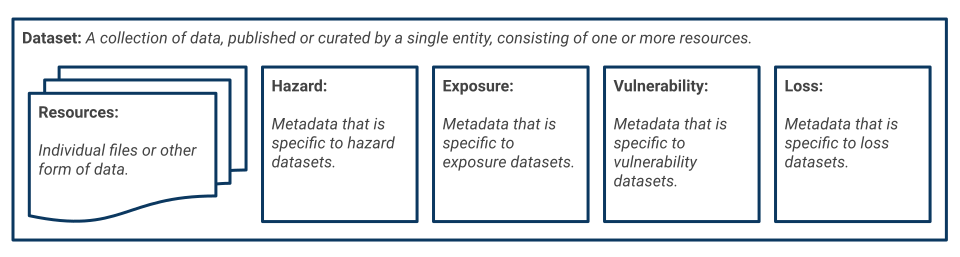

# What is the RDLS?

The Risk Data Library Standard (RDLS) is an open metadata standard for describing risk datasets used in climate and disaster risk assessments.

Metadata is data that provides information about a dataset. The RDLS covers metadata that can apply to any dataset, such as a dataset's title and author, and metadata that is specific to risk datasets, such as the type of hazard a dataset relates to.

## What is included in RDLS:

RDLS defines **metadata** tailored to describe the details of risk data, specifically for four types of dataset:

* Hazard datasets: Describing estimated or observed hazard intensity in disaster events (e.g. contained in geospatial layers or tables).  
* Exposure datasets: Describing the location and attributes of population, buildings, infrastructure, natural resources and other tangible assets. 
* Vulnerability datasets: Describing the relationship between hazard intensity and potential impacts on exposed assets by means of vulnerability and fragility curves, daamge-to-loss models or generic socio-economic vulnerability indexes.
* Loss datasets: Containing the estimated losses, risk or impact of disasters and climate shocks, as a result of analysing hazard, exposure and vulnerability. 

The table below provides a summary. Also see the 'Examples' section to view specific examples of datasets described by RDLS metadata.

## What is not included in RDLS:

RDLS is not intended to describe the 'raw' or 'contextual' data used in creating hazard maps, exposure datasets and vulnerability curves - see table below. Many of these 'baseline' or 'contextual datasets' can be very well described using existing geospatial metadata standards, such as ISO 19115 or DublinCore, and do not require the risk-specific details that are the focus of RDLS. These types of data can be recorded in the `source` object available in the general metadata, which gives the option to link back to the original inputs to creation of, e.g., a hazard dataset.


Component | ✅ Included: datasets used as direct input to and outputs from a risk analysis | ❌ Excluded: datasets used to create those risk analysis inputs, listed left), e.g.:
-- | -- | --
Hazard | <ul><li>Simulated hazard intensity for recent and historical events<li>Simulated hazard intensity for hypothetical/realistic scenario events<li>Estimated maximum hazard intensity for events of defined frequency (return period) scenarios </ul> | <ul><li> Elevation data <li>Gauge/observation records, <li>Satellite imagery or reanalysis data, <li>Environmental information including land use / land cover data or river channel hydrography <li>Climate model outputs</ul>
Exposure | <ul><li>Age- and sex-disaggregated population for a country <li>Location, structural description and replacement cost of buildings and infrastructure in a city <li>Value and typology of agricultural crop </ul> | <ul><li>Census records <li>Satellite imagery <li>Urban extent, urban masterplans</ul>
Vulnerability | <ul><li>Physical vulnerability and fragility curves, and associated damage-to-loss models <li>Engineering-demand   curves <li>Socio-economic vulnerability indexes</ul> | <ul><li>Household surveys <li>Building codes <li>Insurance claims data <li>Post-event damage survey data</ul>
Loss | <ul><li> Risk Estimates: Combination of loss estimate and associated probability/frequency, i.e. AAL or return period loss estimates  <li> Scenario Loss: Loss or impacts simulated for event scenario(s) such as a hypothetical 'worst-case' or historical events. <li> Exposed Value: Subset of total exposure located within the extent of an event  footprint. No vulnerability function is applied so the result is a  measure of how many assets/people or the value of assets that are  considered affected or "at risk". <li>Historical Loss: Observed/reported losses caused by historical (previous) events, for example derived from a historical loss catalog.</ul> | <ul><li>Insurance claims data <li>Post-event damage survey data <li>Post-Disaster Needs Assessment reports</ul>


## Distinguishing between metadata, and data content and structure:

RDLS provides a schema for writing metadata tailored to risk information: it can be used to describe datasets to enable efficient search and understanding of those risk datasets. 

RDLS does not impose a data structure on datasets themselves. The datasets described by RDLS may contain more attributes that are not described in the metadata.

There is an important distinction between data content, data structure and the metadata schema. The RDLS provides a metadata standard but does not impose any specific data structure.

Component | Example of data | Example of metadata
-- | -- | -- 
Hazard | As a minimum, the hazard intensity at each of many locations for the event or scenario represented. | Event name and description, analysis approach, hazard(s) represented, intensity metrics used, climate scenarios represented, links to source data used to generate the hazard datasets, resources referencing methodology. 
Exposure | Location, value, and taxonomy code of assets. | Main category of exposure, associated quantities and cost units used in the dataset, taxonomy standard, spatial extent of dataset, links to source data used to generate the hazard datasets, resources referencing methodology.
Vulnerability | Parameter values for a vulnerability or fragility relationship. | Type of hazard, exposure and the geographic the relationship is relevant for, links to source data used to generate the relationship, resources referencing methodology.  
Loss | Impact and loss values, and location/area they apply to. | Type of hazard and exposure considered, type and unit of impact considered, datasets used in generating the losses. 

The [RDLS schema](../reference/schema/index.md) defines the meaning, structure and format of RDLS metadata. It defines the list of fields that can be used to describe risk datasets. RDLS metadata is structured as follows:



Metadata fields that are common to all resources are specified at the dataset level, whilst metadata fields that can vary by resource are specified at the resource level. Metadata fields that are specific to a particular type of risk data are specified at the dataset level and grouped under the relevant object: Hazard, Exposure, Vulnerability or Loss.

The schema specifies a title, description and data type for each field. The schema also specifies other rules to which RDLS metadata needs to conform, such as which fields are mandatory and whether fields need to conform to a particular format or range of values. Some fields refer to [codelists](../reference/codelists.md) to limit and standardise their values.

For example, the `risk_data_type` field is defined as follows:

```{jsonschema} ../../docs/_readthedocs/html/rdls_schema.json
---
include: risk_data_type
---
```

For more information on the fields, structure and format of RDLS metadata, refer to the [metadata reference](../reference/index.md).
