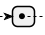

# Schema reference

The schema provides the authoritative definition of the structure of Risk Data Library Standard (RDLS) data, the meaning of each field, and the rules that must be followed to publish RDLS data. It is used to validate the structure and format of RDLS data.

For this version of RDLS, the canonical URL of the schema is [https://raw.githubusercontent.com/GFDRR/rdl-standard/0\_\_2\_\_0/schema/rdls_schema.json](https://raw.githubusercontent.com/GFDRR/rdl-standard/0__2__0/schema/rdls_schema.json). Use the canonical URL to make sure that your software, documentation or other resources refer to the specific version of the schema with which they were tested.

This page presents the schema in tables with additional information in paragraphs. You can also [view the schema in an interactive browser](browser.md) or [download it as JSON Schema](../../docs/_readthedocs/html/rdls_schema.json).

```{note}
   If any conflicts are found between the text on this page and the text within the schema, the text within the schema takes precedence.
```

The RDLS schema covers [dataset fields](#dataset), [resource fields](#resource) and four risk-specific components to describe risk datasets:

- [Hazard](#hazard-metadata): Metadata that is specific to datasets that describe processes or phenomena that may cause loss of life, injury or other health impacts, property damage, social and economic disruption or environmental degradation. For example, a classification of the type of the hazard, the units in which the intensity of the hazard is measured, and the frequency at which the hazard occurs.
- [Exposure](#exposure-metadata): Metadata that is specific to datasets that describe the location and demographic information of people, and the location, characteristics and value of assets in the built and natural environment. For example, the type of building and the cost to replace it if it suffered damage.
- [Vulnerability](#vulnerability-metadata): Metadata that is specific to datasets that describe the vulnerability and fragility relationships and indexes used in risk analysis. This includes the type of exposure, hazard intensity and impact the relationship describes, and information on how the relationship was developed. This component uses attributes consistent with the hazard, exposure and loss components.
- [Loss](#loss-metadata): Metadata that is specific to datasets that contain the simulated (modeled) risk and impact estimates produced in a risk assessment, including explicit links to the hazard, exposure, and vulnerability datasets used in the analysis.

For general definitions of hazard, exposure, vulnerability and loss, please see the [Glossary](../glossary.md).

For fields that reference [sub-schemas](#sub-schemas), a link is provided to a table with details of the sub-schema. To see how the fields and sub-schemas fit together, consult the [schema browser](browser.md).

## Dataset

The top-level object in the RDLS schema is a risk dataset. A risk dataset is described as:

```{jsoninclude-quote} ../../docs/_readthedocs/html/rdls_schema.json
---
jsonpointer: /description
---
```

The general attributes of a dataset are described by fields based on the [Data Catalog Vocabulary](https://www.w3.org/TR/vocab-dcat-3/) and the [Dublin Core Metadata Initiative Metadata Terms](https://www.dublincore.org/specifications/dublin-core/dcmi-terms).

The following diagram shows a subset of dataset-level fields, with required fields highlighted in blue:

```{eval-rst}
.. uml::

  @startjson
  <style>
    jsonDiagram {
      BackGroundColor transparent
    }
    .required {
      BackGroundColor #239ce8
    }
  </style>
  #highlight "title" <<required>>
  #highlight "risk_data_type" <<required>>
  #highlight "publisher" <<required>>
  #highlight "publisher" / "name" <<required>>
  #highlight "spatial" <<required>>
  #highlight "license" <<required>>
  {
    "title": "",
    "description": "",
    "risk_data_type": "",
    "publisher": {
      "name": "",
      "email": "",
      "url": ""
    },
    "version": "",
    "purpose": "",
    "project": "",
    "details": "",
    "spatial": {
      "countries": "",
      "bbox": ""
    },
    "license": ""
  }
  @endjson

```

The following table lists all dataset-level fields:

```{jsonschema} ../../docs/_readthedocs/html/rdls_schema.json
---
collapse: 
  publisher,spatial,resources,referenced_by,contact_point,creator,attributions,sources,links,hazard,exposure,vulnerability,loss
addtargets:
---
```

## Resource

A `Resource` is defined as:

```{jsoninclude-quote} ../../docs/_readthedocs/html/rdls_schema.json
---
jsonpointer: /$defs/Resource/description
---
```

Each dataset can have many associated resources.

The following table lists all resource-level fields:

```{jsonschema} ../../docs/_readthedocs/html/rdls_schema.json
---
pointer: /$defs/Resource
collapse: temporal
addtargets:
---
```

## Hazard metadata

The `hazard` component is described as:

```{jsoninclude-quote} ../../docs/_readthedocs/html/rdls_schema.json
---
jsonpointer: /properties/hazard/description
---
```

The hazard component describes metadata about modeled natural hazards data, including hazard intensity footprints of historical or hypothetical events, return period hazard maps, hazard or susceptibility index, and stochastic event sets. The metadata defines the hazard type, physical process and intensity measures used in the dataset. Multiple hazards and processes (including cascading events) can be defined for each hazard, enabling users to describe dataset that contain, for example, earthquake ground shaking and liquefaction, and tsunami inundation triggered by the earthquake.

The hazard component uses hazard_type, process_type and intensity_measure consistent with the vulnerability and loss components of this standard. Spatial reference and location information are described using existing external standards. Temporal information can include date and duration of events or year of scenario, and is defined using the Dublin Core standards.

The following diagram shows a subset of hazard component fields, with required fields highlighted in blue. The  icon indicates that a field is an array.

```{eval-rst}
.. uml::

  @startjson
  <style>
    jsonDiagram {
      BackGroundColor transparent
    }
    .required {
      BackGroundColor #239ce8
    }
  </style>
  #highlight "event_sets" <<required>>
  #highlight "event_sets" / 0 / "analysis_type" <<required>>
  #highlight "event_sets" / 0 / "events" / 0 / "calculation_method" <<required>>
  #highlight "event_sets" / 0 / "events" / 0 / "hazard" <<required>>
  #highlight "event_sets" / 0 / "events" / 0 / "hazard" / "type" <<required>>
  #highlight "event_sets" / 0 / "events" / 0 / "hazard" / "processes" <<required>>
  #highlight "event_sets" / 0 / "events" / 0 / "occurrence" <<required>>
  #highlight "event_sets" / 0 / "events" / 0 / "footprints" / 0 / "intensity_measure" <<required>>
  {
    "event_sets": [
      {
        "analysis_type": "",
        "frequency_distribution": "",
        "seasonality": "",
        "event_count": "",
        "occurrence_range": "",
        "spatial": "",
        "temporal": "",
        "events": [
          {
            "disaster_identifier": "",
            "calculation_method": "",
            "description": "",
            "hazard": {
              "type": "",
              "processes": "",
              "intensity_measure": "",
              "trigger": ""
            },
            "occurence": "",
            "footprints": [
              {
                "intensity_measure": "",
                "data_uncertainty": ""
              }
            ]
          }
        ]
      }
    ]
  }
  @endjson

```

The following table lists all hazard component fields:

```{jsonschema} ../../docs/_readthedocs/html/rdls_schema.json
---
pointer: /properties/hazard
collapse: 
  event_sets/0/hazards,event_sets/0/spatial,event_sets/0/temporal,event_sets/0/events
addtargets:
---
```

Hazard data are most often represented by geospatial grids (raster); sometimes they are represented by points or polygons.

**Flood hazard maps for Kabul**

Schema attributes for flood hazard map related to the occurrence probability of a river flood event with a return period of once in 100 years over Kabul, Afghanistan. The hydrological data used for modelling the intensity of floods is derived from observations over the period 1958-2001 (44 years). The hazard intensity is measured as water depth, in meters. These information cover all mandatory fields, and a few optional fields.


| **Required** | **Attribute**           | **Example**     |
| :----------: | ----------------------- | --------------- |
|      \*      | Hazard type             | Flood           |
|      \*      | Analysis type           | Probabilistic   |
|      \*      | Calculation method      | Simulated       |
|              | Geographic area         | Kabul           |
|              | Frequency type          | Return Period   |
|              | Occurrence probability  | 100 years       |
|              | Occurrence time (start) | 1958            |
|              | Occurrence time (end)   | 2001            |
|              | Occurrence time (span)  | 44 years        |
|      \*      | Hazard process          | River flood     |
|      \*      | Unit of measure         | Water depth (m) |

**Earthquake hazard maps for Afghanistan**

Schema attributes for an earthquake hazard map related to an occurrence probability of an event with return period of once in 1000 years over Afghanistan. The seismic data catalogue behind the calculation of occurrence probability starts from year 800, covering a period of 1200 years. The hazard intensity is measured as Peak Ground Acceleration, expressed in (g).


| **Required** | **Attribute**           | **Example**   |
| :----------: | ----------------------- | ------------- |
|      \*      | Hazard type             | Earthquake    |
|      \*      | Analysis type           | Probabilistic |
|      \*      | Calculation method      | Simulated     |
|              | Frequency type          | Return Period |
|              | Occurrence probability  | 1000 years    |
|              | Occurrence time (start) | 800           |
|              | Occurrence time (end)   | 2001          |
|              | Occurrence time (span)  | 1200 years    |
|      \*      | Hazard process          | Ground motion |
|      \*      | Unit of measure         | PGA (g)       |

## Exposure metadata

The `exposure` component is described as:

```{jsoninclude-quote} ../../docs/_readthedocs/html/rdls_schema.json
---
jsonpointer: /properties/exposure/description
---
```

The exposure component describes metadata for datasets containing information on the distribution and characteristics of built environment assets (buildings and infrastructure) and natural assets and population, that are used in risk assessment. The exposure component provides codelists to describe the type of assets and costs, and the taxonomy scheme that is used to describe construction and demographic information contained in the dataset. For more information, see [exposure standards](../rdl/other-standards.md#exposure-standards).

The exposure component uses exposure categories consistent with the vulnerability and loss components of this standard. Spatial reference and location information are described using existing external standards. Temporal information can include date and duration of events or year of scenario, and is defined using the Dublin Core standards.

The following diagram shows a subset of exposure component fields, with required fields highlighted in blue. The  icon indicates that a field is an array.

```{eval-rst}
.. uml::

  @startjson
  <style>
    jsonDiagram {
      BackGroundColor transparent
    }
    .required {
      BackGroundColor #239ce8
    }
  </style>
  #highlight "exposure" / "category" <<required>>
  #highlight "exposure" / "metrics" / 0 / "quantity_kind" <<required>>
  {
    "exposure": {
      "category": "",
      "taxonomy": "",
      "metrics": [
        {
          "dimension": "",
          "quantity_kind": ""
        }
      ]
    }
  }
  @endjson

```

The following table lists all exposure component fields:

```{jsonschema} ../../docs/_readthedocs/html/rdls_schema.json
---
pointer: /properties/exposure
collapse: metrics
addtargets:
---
```

Exposure data can be stored at multiple scales, more often using vectors, namely polygons (e.g. building footprint), points (e.g. asset geolocation) and lines (e.g. transport infrastructures, lifelines), but in same case exposure estimates are aggregated at ADM level or distributed over a raster grid.

**Exposure map for Kabul**

Two exposure datasets are shown together in the example: building footprints polygons and population density raster at 90 m resolution.


| **Required** | **Attribute**       | **Example** |
| :----------: | ------------------- | ----------- |
|      \*      | Geographic coverage | Afghanistan |
|      \*      | Exposure category   | Buildings   |
|      \*      | Occupancy           | Mixed       |
|              | Taxonomy            | OSM         |
|      \*      | Value type          | Structure   |
|      \*      | Unit of measure     | USD         |

| **Required** | **Attribute**       | **Example** |
| :----------: | ------------------- | ----------- |
|      \*      | Geographic coverage | Afghanistan |
|      \*      | Exposure category   | Indicators  |
|      \*      | Occupancy           | Residential |
|              | Period of occupancy | Night       |
|      \*      | Value type          | Other       |
|      \*      | Unit of measure     | Count       |

## Vulnerability metadata

The `vulnerability` component is described as:

```{jsoninclude-quote} ../../docs/_readthedocs/html/rdls_schema.json
---
jsonpointer: /properties/vulnerability/description
---
```

The vulnerability component describes metadata for datasets that detail fragility, damage-to-loss and vulnerability relationships and indexes for physical damage and social vulnerability that are used in risk analysis. It contains key information including the type of function, intensity and impact metrics used, which asset types or population groups it applies to, how it was developed and for what locations.

The vulnerability component uses hazard_type, process_type and intensity_measure consistent with the hazard and loss components, exposure information consistent with the exposure and loss components. Spatial reference and location information are described using existing external standards.

The following diagram shows a subset of vulnerability component fields, with required fields highlighted in blue:

```{eval-rst}
.. uml::

  @startjson
  <style>
    jsonDiagram {
      BackGroundColor transparent
    }
    .required {
      BackGroundColor #239ce8
    }
  </style>
  #highlight "hazard_primary" <<required>>
  #highlight "intensity" <<required>>
  #highlight "category" <<required>>
  #highlight "impact" <<required>>
  #highlight "functions" <<required>>
  {
    "hazard_primary": "",
    "hazard_secondary": "",
    "intensity": "",
    "category": "",
    "impact": {
      "type": "",
      "metric": "",
      "unit": ""
    },
    "functions": {
      "vulnerabiity": "",
      "fragility": "",
      "damage_to_loss": "",
      "engineering_demand": ""
    },
    "se_category": ""
  }
  @endjson

```

The following table lists all vulnerability component fields:

```{jsonschema} ../../docs/_readthedocs/html/rdls_schema.json
---
pointer: /properties/vulnerability
collapse: cost,impact,spatial,se_category
addtargets:
---
```

## Loss metadata

The `loss` component is described as:

```{jsoninclude-quote} ../../docs/_readthedocs/html/rdls_schema.json
---
jsonpointer: /properties/loss/description
---
```

The loss component provides metadata describing data generated in risk assessments, i.e., modelled impacts and losses for single historical events or hypothetical scenarios and risk estimates from analysis of large event sets. The data can include monetary and non-monetary, and direct or indirect, impacts and losses.
Loss datasets can be explicitly linked to the exposure, hazard, and vulnerability datasets used in the analysis. This component uses descriptions of assets, hazards and impact types consistent with all other components of this standard. Spatial reference and location information are described using existing external standards. Temporal information can include date and duration of events or year of scenario, and is defined using the Dublin Core standards.

The following diagram shows a subset of loss component fields, with required fields highlighted in blue:

```{eval-rst}
.. uml::

  @startjson
  <style>
    jsonDiagram {
      BackGroundColor transparent
    }
    .required {
      BackGroundColor #239ce8
    }
  </style>
  #highlight "hazard_type" <<required>>
  #highlight "cost" <<required>>
  #highlight "cost" / "type" <<required>>
  #highlight "cost" / "unit" <<required>>
  {
    "hazard_type": "",
    "hazard_process": "",
    "category": "",
    "type": "",
    "impact": {
      "type": "",
      "metric": "",
      "unit": ""
    },
    "approach": "",
    "cost": {
      "type": "",
      "unit": ""
    }
  }
  @endjson

```

The following table lists all loss component fields:

```{jsonschema} ../../docs/_readthedocs/html/rdls_schema.json
---
pointer: /properties/loss
collapse: cost,impact
addtargets:
---
```

Losses can be represented in many different way: regular raster grids, points, or polygons. Often, the loss data consist of measures aggregated at the administrative unit level.

**Flood loss scenarios for Afghanistan, 2050**

Schema attributes for loss map related to future river flood hazard scenarios (2050) over all types of exposure occupancies for Afghanistan.


The losses are higher in the most densely built-up area of Kabul.


| **Required** | **Attribute**          | **Example**                                                             |
| :----------: | ---------------------- | ----------------------------------------------------------------------- |
|      \*      | Hazard type            | Flood                                                                   |
|              | Hazard process         | River flood                                                             |
|      \*      | Exposure occupancy     | Mixed                                                                   |
|      \*      | Exposure category      | Buildings                                                               |
|      \*      | Value type             | Structure                                                               |
|              | Hazard link            | [Dataset](http://jkan.riskdatalibrary.org/datasets/hzd-afg-fl-baseline) |
|              | Exposure link          |                                                                         |
|              | Vulnerability link     |                                                                         |
|              | Time year              | 2050                                                                    |
|              | Frequency type         | Return Period                                                           |
|              | Occurrence probability | RP 5-1000 years                                                         |
|      \*      | Impact                 | Direct                                                                  |
|      \*      | Loss type              | Ground up                                                               |
|      \*      | Metric                 | Average Annual Losses                                                   |


______________________________________________________________________

**Observed losses**

Insert example of recorded empirical losses.

| **Required** | **Attribute**           | **Example**   |
| :----------: | ----------------------- | ------------- |
|      \*      | Hazard type             | Earthquake    |
|      \*      | Analysis type           | Probabilistic |
|      \*      | Calculation method      | Simulated     |
|              | Frequency type          | Return Period |
|              | Occurrence probability  | 1000 years    |
|              | Occurrence time (start) | 800           |
|              | Occurrence time (end)   | 2001          |
|              | Occurrence time (span)  | 1200 years    |
|      \*      | Hazard process          | Ground motion |
|      \*      | Unit of measure         | PGA (g)       |

## Sub-schemas

### Entity

`Entity` is defined as:

```{jsoninclude-quote} ../../docs/_readthedocs/html/rdls_schema.json
---
jsonpointer: /$defs/Entity/description
---
```

This sub-schema is referenced by the following properties:

- [`publisher`](rdls_schema.json,,publisher)
- [`contact_point`](rdls_schema.json,,contact_point)
- [`creator`](rdls_schema.json,,creator)
- [`Attribution/entity`](rdls_schema.json,/$defs/Attribution,entity)

Each `Entity` has the following fields:

```{jsonschema} ../../docs/_readthedocs/html/rdls_schema.json
---
pointer: /$defs/Entity
collapse:
addtargets:
---
```

### Attribution

`Attribution` is defined as:

```{jsoninclude-quote} ../../docs/_readthedocs/html/rdls_schema.json
---
jsonpointer: /$defs/Attribution/description
---
```

This sub-schema is referenced by the following properties:

- [`attributions`](rdls_schema.json,,attributions)

Each `Attribution` has the following fields:

```{jsonschema} ../../docs/_readthedocs/html/rdls_schema.json
---
pointer: /$defs/Attribution
collapse: entity
addtargets:
---
```

### Related_resource

`Related_resource` is defined as:

```{jsoninclude-quote} ../../docs/_readthedocs/html/rdls_schema.json
---
jsonpointer: /$defs/Related_resource/description
---
```

This sub-schema is referenced by the following properties:

- [`referenced_by`](rdls_schema.json,,referenced_by)

Each `Related_resource` has the following fields:

```{jsonschema} ../../docs/_readthedocs/html/rdls_schema.json
---
pointer: /$defs/Related_resource
collapse:
addtargets:
---
```

### Source

`Source` is defined as:

```{jsoninclude-quote} ../../docs/_readthedocs/html/rdls_schema.json
---
jsonpointer: /$defs/Source/description
---
```

This sub-schema is referenced by the following properties:

- [`sources`](rdls_schema.json,,sources)

Each `Source` has the following fields:

```{jsonschema} ../../docs/_readthedocs/html/rdls_schema.json
---
pointer: /$defs/Source
collapse:
addtargets:
---
```

### Period

`Period` is defined as:

```{jsoninclude-quote} ../../docs/_readthedocs/html/rdls_schema.json
---
jsonpointer: /$defs/Period/description
---
```

This sub-schema is referenced by the following properties:

- [`Resource/temporal`](rdls_schema.json,/$defs/Resource,temporal)
- [`Event_set/temporal`](rdls_schema.json,/$defs/Event_set,temporal)
- [`Event/occurrence/empirical/temporal`](rdls_schema.json,/$defs/Event,occurrence/empirical/temporal)

Each `Period` has the following fields:

```{jsonschema} ../../docs/_readthedocs/html/rdls_schema.json
---
pointer: /$defs/Period
collapse:
addtargets:
---
```

### Location

`Location` is defined as:

```{jsoninclude-quote} ../../docs/_readthedocs/html/rdls_schema.json
---
jsonpointer: /$defs/Location/description
---
```

This sub-schema is referenced by the following properties:

- [`spatial`](rdls_schema.json,,spatial)
- [`vulnerability/spatial`](rdls_schema.json,/properties/vulnerability,spatial)
- [`Event_set/spatial`](rdls_schema.json,/$defs/Event_set,spatial)

Each `Location` has the following fields:

```{jsonschema} ../../docs/_readthedocs/html/rdls_schema.json
---
pointer: /$defs/Location
collapse: geometry
addtargets:
---
```

### Gazetteer_entry

`Gazetteer_entry` is defined as:

```{jsoninclude-quote} ../../docs/_readthedocs/html/rdls_schema.json
---
jsonpointer: /$defs/Gazetteer_entry/description
---
```

This sub-schema is referenced by the following properties:

- [`Location/gazetteerEntries`](rdls_schema.json,/$defs/Location,gazetteerEntries)

Each `Gazetteer_entry` has the following fields:

```{jsonschema} ../../docs/_readthedocs/html/rdls_schema.json
---
pointer: /$defs/Gazetteer_entry
collapse:
addtargets:
---
```

### Geometry

`Geometry` is defined as:

```{jsoninclude-quote} ../../docs/_readthedocs/html/rdls_schema.json
---
jsonpointer: /$defs/Geometry/description
---
```

This sub-schema is referenced by the following properties:

- [`Location/geometry`](rdls_schema.json,/$defs/Location,geometry)

Each `Geometry` has the following fields:

```{jsonschema} ../../docs/_readthedocs/html/rdls_schema.json
---
pointer: /$defs/Geometry
collapse:
addtargets:
---
```

### Hazard

`Hazard` is defined as:

```{jsoninclude-quote} ../../docs/_readthedocs/html/rdls_schema.json
---
jsonpointer: /$defs/Hazard/description
---
```

This sub-schema is referenced by the following properties:

- [`Event_set/hazards`](rdls_schema.json,/$defs/Event_set,hazards)
- [`Event/hazard`](rdls_schema.json,/$defs/Event,hazard)

Each `Hazard` has the following fields:

```{jsonschema} ../../docs/_readthedocs/html/rdls_schema.json
---
pointer: /$defs/Hazard
collapse: trigger
addtargets:
---
```

### Trigger

`Trigger` is defined as:

```{jsoninclude-quote} ../../docs/_readthedocs/html/rdls_schema.json
---
jsonpointer: /$defs/Trigger/description
---
```

This sub-schema is referenced by the following properties:

- [`Hazard/trigger`](rdls_schema.json,/$defs/Hazard,trigger)

Each `Trigger` has the following fields:

```{jsonschema} ../../docs/_readthedocs/html/rdls_schema.json
---
pointer: /$defs/Trigger
collapse:
addtargets:
---
```

### Event_set

`Event_set` is defined as:

```{jsoninclude-quote} ../../docs/_readthedocs/html/rdls_schema.json
---
jsonpointer: /$defs/Event_set/description
---
```

This sub-schema is referenced by the following properties:

- [`hazard/event_sets`](rdls_schema.json,/properties/hazard,event_sets)

Each `Event_set` has the following fields:

```{jsonschema} ../../docs/_readthedocs/html/rdls_schema.json
---
pointer: /$defs/Event_set
collapse: spatial,temporal
addtargets:
---
```

### Event

`Event` is defined as:

```{jsoninclude-quote} ../../docs/_readthedocs/html/rdls_schema.json
---
jsonpointer: /$defs/Event/description
---
```

This sub-schema is referenced by the following properties:

- [`Event_set/events`](rdls_schema.json,/$defs/Event_set,events)

Each `Event` has the following fields:

```{jsonschema} ../../docs/_readthedocs/html/rdls_schema.json
---
pointer: /$defs/Event
collapse: hazard
addtargets:
---
```

### Footprint

`Footprint` is defined as:

```{jsoninclude-quote} ../../docs/_readthedocs/html/rdls_schema.json
---
jsonpointer: /$defs/Footprint/description
---
```

This sub-schema is referenced by the following properties:

- [`Event/footprints`](rdls_schema.json,/$defs/Event,footprints)

Each `Footprint` has the following fields:

```{jsonschema} ../../docs/_readthedocs/html/rdls_schema.json
---
pointer: /$defs/Footprint
collapse:
addtargets:
---
```

### Metric

`Metric` is defined as:

```{jsoninclude-quote} ../../docs/_readthedocs/html/rdls_schema.json
---
jsonpointer: /$defs/Metric/description
---
```

This sub-schema is referenced by the following properties:

- [`exposure/metrics`](rdls_schema.json,/properties/exposure,metrics)

Each `Metric` has the following fields:

```{jsonschema} ../../docs/_readthedocs/html/rdls_schema.json
---
pointer: /$defs/Metric
collapse:
addtargets:
---
```

### Cost

`Cost` is defined as:

```{jsoninclude-quote} ../../docs/_readthedocs/html/rdls_schema.json
---
jsonpointer: /$defs/Cost/description
---
```

This sub-schema is referenced by the following properties:

- [`vulnerability/cost`](rdls_schema.json,/properties/vulnerability,cost)
- [`loss/cost`](rdls_schema.json,/properties/loss,cost)

Each `Cost` has the following fields:

```{jsonschema} ../../docs/_readthedocs/html/rdls_schema.json
---
pointer: /$defs/Cost
collapse:
addtargets:
---
```

### Probabilistic

`Probabilistic` is defined as:

```{jsoninclude-quote} ../../docs/_readthedocs/html/rdls_schema.json
---
jsonpointer: /$defs/Probabilistic/description
---
```

This sub-schema is referenced by the following properties:

- [`Event/occurrence/probabilistic`](rdls_schema.json,/$defs/Event,occurrence/probabilistic)

Each `Probabilistic` has the following fields:

```{jsonschema} ../../docs/_readthedocs/html/rdls_schema.json
---
pointer: /$defs/Probabilistic
collapse:
addtargets:
---
```

### Impact

`Impact` is defined as:

```{jsoninclude-quote} ../../docs/_readthedocs/html/rdls_schema.json
---
jsonpointer: /$defs/Impact/description
---
```

This sub-schema is referenced by the following properties:

- [`vulnerability/impact`](rdls_schema.json,/properties/vulnerability,impact)
- [`loss/impact`](rdls_schema.json,/properties/loss,impact)

Each `Impact` has the following fields:

```{jsonschema} ../../docs/_readthedocs/html/rdls_schema.json
---
pointer: /$defs/Impact
collapse:
addtargets:
---
```

### Classification

`Classification` is defined as:

```{jsoninclude-quote} ../../docs/_readthedocs/html/rdls_schema.json
---
jsonpointer: /$defs/Classification/description
---
```

This sub-schema is referenced by the following properties:

- [`vulnerability/se_category`](rdls_schema.json,/properties/vulnerability,se_category)

Each `Classification` has the following fields:

```{jsonschema} ../../docs/_readthedocs/html/rdls_schema.json
---
pointer: /$defs/Classification
collapse:
addtargets:
---
```

### Link

`Link` is defined as:

```{jsoninclude-quote} ../../docs/_readthedocs/html/rdls_schema.json
---
jsonpointer: /$defs/Link/description
---
```

This sub-schema is referenced by the following properties:

- [`links`](rdls_schema.json,,links)

Each `Link` has the following fields:

```{jsonschema} ../../docs/_readthedocs/html/rdls_schema.json
---
pointer: /$defs/Link
collapse:
addtargets:
---
```
