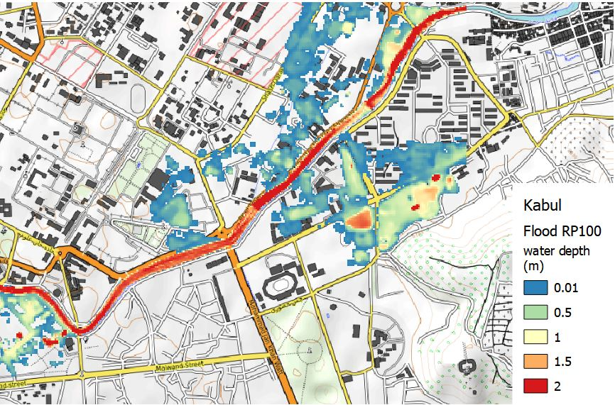
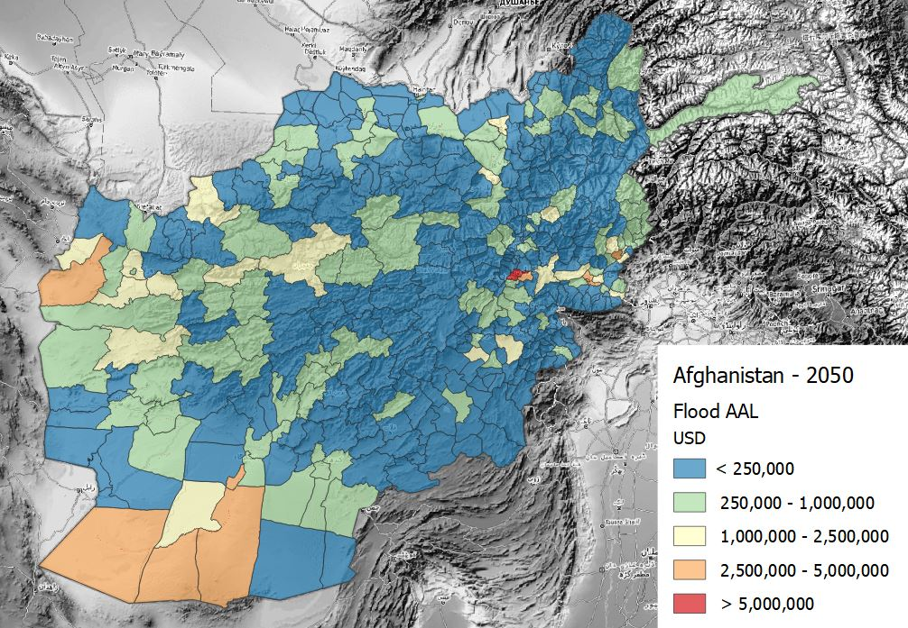
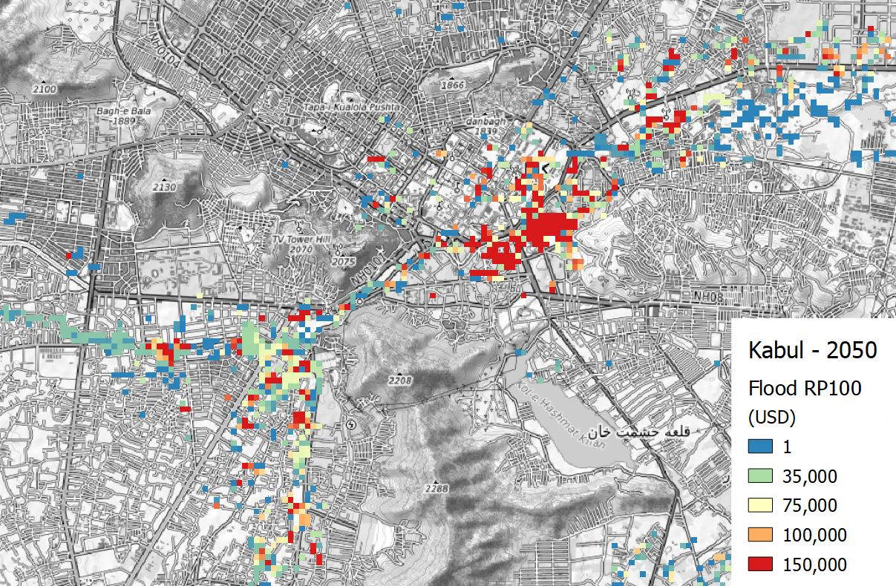
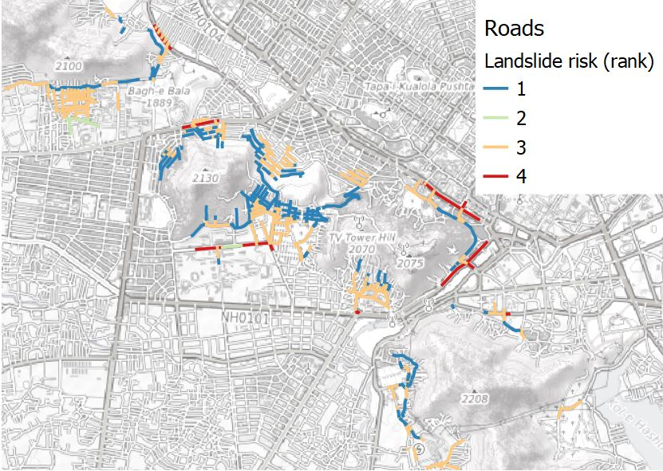

# Schema reference

The schema provides the authoritative definition of the structure of Risk Data Library Standard (RDLS) data, the meaning of each field, and the rules that must be followed to publish RDLS data. It is used to validate the structure and format of RDLS data.

For this version of RDLS, the canonical URL of the schema is \[\]\](). Use the canonical URL to make sure that your software, documentation or other resources refer to the specific version of the schema with which they were tested.

This page presents the schema in tables with additional information in paragraphs. You can also [view the schema in an interactive browser](browser.md) or [download it as JSON Schema](../../docs/_readthedocs/html/rdl_schema_0.1.json).

```{note}
   If any conflicts are found between the text on this page and the text within the schema, the text within the schema takes precedence.
```

The RDLS schema covers [dataset attributes](#dataset), [resource attributes](#resource) and four risk-specific components:

- [Hazard](#hazard): main hazard type, specific process, trigger of the hazard, occurrence frequency of event, intensity unit to measure the process and analytical method.
- [Exposure](#exposure): asset category, specific taxonomy, cost type and value.
- [Vulnerability](#vulnerability): model that links hazard intensity and exposure classification to measure of impact over the total exposed value.
- [Loss](#loss): modelled damage and losses produced in a risk assessment as a function of hazard, exposure and vulnerability components.

For definitions of these terms, please see the [Glossary](../glossary.md).

For fields that reference [sub-schemas](#sub-schemas), a link is provided to a table with details of the sub-schema. To see how the fields and sub-schemas fit together, consult the [schema browser](browser.md).

The diagram below shows the core relationships between schema components, and their core attributes.

```{eval-rst}
 .. mermaid::

  classDiagram
      Dataset -- Hazard
      Dataset -- Exposure
      Dataset -- Vulnerability
      Dataset -- Loss
      Dataset: -Project name
      Dataset: -Coverage
      Dataset: -Purpose
      Dataset: -Bibliography
      class Hazard{
        -Type, Process
        -Trigger
        -Frequency
        -Intensity unit
        -Analytical method
          }
      class Exposure{
        -Asset category
        -Occupancy
        -Taxonomy
        -Cost type
      }
      class Vulnerability{
        -Hazard process
        -Exposure taxonomy
        -Analytical method 
        -Applicability
      }
      class Loss{
        -Hazard process
        -Exposure taxonomy
        -Loss frequency
        -Loss metric
      }          
```

## Dataset

In addition to schema-specific attributes, each dataset is identified by a list of attributes based on the [Dublin Core Metadata Initiative Metadata Terms](https://www.dublincore.org/specifications/dublin-core/dcmi-terms).

```{jsonschema} ../../docs/_readthedocs/html/rdl_schema_0.1.json
---
collapse: spatial,resources
addtargets:
---
```

## Resource

Other attributes are specific to individual resources, covering level of aggregation, resolution and format.

```{jsonschema} ../../docs/_readthedocs/html/rdl_schema_0.1.json
---
pointer: /$defs/Resource
collapse: temporal
addtargets:
---
```

## Hazard

The hazard schema stores data about the intensity and occurrence probability of physical hazard phenomena such as floods, earthquakes, wildfires or others. The specific hazard process can be defined and measured with a specific intensity unit. For example, earthquake hazard may be represented as ground shaking, liquefaction or ground displacement.

```{eval-rst}
 .. mermaid::

  classDiagram
      Event set -- Event1
      Event set -- Event2
      Event set: Hazard type
      Event set: Analytical method
      class Event1{
        Occurrence frequency
        Time reference
        Hazard trigger
      }
      class Event2{
        Occurrence frequency
        Time reference
        Hazard trigger
      }
      Event1 -- Footprint1
      Event1 -- Footprint2
      Event2 -- Footprint3
      Event2 -- Footprint4
      class Footprint1{
        Hazard process
        Intensity measure
        Uncertainty
      }
      class Footprint2{
        Hazard process
        Intensity measure
        Uncertainty
      }
      class Footprint3{
        Hazard process
        Intensity measure
        Uncertainty
      }
      class Footprint4{
        Hazard process
        Intensity measure
        Uncertainty
      }
```

The hazard schema specifies which type of analysis and data methodology has generated the dataset. It supports either simulated probabilistic scenarios or empirical observations. If the dataset has been produced for a specific location, such a city, the name of the location can be included.

When the scenario modelled refers to a specific period of time, this can be specified in terms of dates, period span and reference year. For example, an observed flood event that occurred from 2009-10-01 (time start) to 2009-10-03 (time end), spanning over 3 days (time span). When precise time collocation is unknown or not applicable, a general reference date such as "2009" is used to identify events (time year). This is also useful to specify future scenario, e.g. time year: 2050.

When instead the hazard scenario is represented in probabilistic terms, the occurrence probability (frequency distribution) of hazard can be expressed in different ways. The most common way to communicate this is the "return period", expressed as the number of years after which a given hazard intensity could occur again: RP 100 indicates that that event has a probability of once in 100 years. This attribute can indicate individual layer frequency (RP100) or a range of frequencies for a collection of layers (RP10-100) The probability of occurrence is usually calculated on the basis of a reference period that provides observations: this period can be specified by start date, end date and time span. For example, an analysis of earthquake frequency based on seismic observations from 1934 (occurrence time start) to 2001 (occurrence time end), for a total count of 66 years (occurrence time span).

The schema distinguishes between the hazard and process represented, and the hazard and process identified as the cause, or con-cause for the manifestation of the represented hazard. For example, a dataset representing a landslide hazard that is triggered by an earthquake will have Hazard type: Landslide; Trigger hazard type: Earthquake. The unit of measure refers to the represented hazard and process. A description can be added to cover additional information not included in the schema.

The hazard dataset could include one or more footprints for the same event, where each is one possible realisation (i.e. one footprint could represent minimum, another footprint the average and another one the maximum). The event uncertainty can be represented explicitly, through the inclusion of multiple footprints per event.

`````{tab-set}

````{tab-item} Schema

```{jsonschema} ../../docs/_readthedocs/html/rdl_schema_0.1.json
---
pointer: /anyOf/0/properties/hazard
collapse:
addtargets:
---
```

````

````{tab-item} Examples

Hazard data are most often represented by geospatial grids (raster); sometimes they are represented by points or polygons.

**Flood hazard maps for Kabul**

Schema attributes for flood hazard map related to the occurrence probability of a river flood event with a return period of once in 100 years over Kabul, Afghanistan. The hydrological data used for modelling the intensity of floods is derived from observations over the period 1958-2001 (44 years). The hazard intensity is measured as water depth, in meters. These information cover all mandatory fields, and a few optional fields.



| **Required** | **Attribute**           | **Example**     |
| :----------: | ----------------------- | --------------- |
|      \*      | Hazard type             | Flood           |
|      \*      | Analysis type           | Probabilistic   |
|      \*      | Calculation method      | Simulated       |
|              | Geographic area         | Kabul           |
|              | Frequency type          | Return Period   |
|              | Occurrence probability  | 100 years       |
|              | Occurrence time (start) | 1958            |
|              | Occurrence time (end)   | 2001            |
|              | Occurrence time (span)  | 44 years        |
|      \*      | Hazard process          | River flood     |
|      \*      | Unit of measure         | Water depth (m) |

**Earthquake hazard maps for Afghanistan**

Schema attributes for an earthquake hazard map related to an occurrence probability of an event with return period of once in 1000 years over Afghanistan. The seismic data catalogue behind the calculation of occurrence probability starts from year 800, covering a period of 1200 years. The hazard intensity is measured as Peak Ground Acceleration, expressed in (g).


| **Required** | **Attribute**           | **Example**   |
| :----------: | ----------------------- | ------------- |
|      \*      | Hazard type             | Earthquake    |
|      \*      | Analysis type           | Probabilistic |
|      \*      | Calculation method      | Simulated     |
|              | Frequency type          | Return Period |
|              | Occurrence probability  | 1000 years    |
|              | Occurrence time (start) | 800           |
|              | Occurrence time (end)   | 2001          |
|              | Occurrence time (span)  | 1200 years    |
|      \*      | Hazard process          | Ground motion |
|      \*      | Unit of measure         | PGA (g)       |


````

`````

## Exposure

The exposure schema covers a wide variety of data describing structural, infrastructural and environmental asset, population, and socio-economic descriptors, each with relevant attributes for assessing risk from multiple hazards. The schema was developed based on [GEM Taxonomy 2.0](https://wiki.openstreetmap.org/wiki/GED4ALL) to accommodate the most important spatial features commonly employed in risk analysis to identify and estimate exposed value.

```{eval-rst}
 .. mermaid::

  classDiagram
      Model -- Asset1
      Model -- Asset2
      Model: Category
      Model: Occupancy
      class Asset1{
        Taxonomy code
        Value type
        Value unit
      }
      class Asset2{
        Taxonomy code
        Value type
        Value unit
      }
```

The main features of an exposure dataset are specified by the **exposure model** attributes.
Each exposure model includes one or more **assets**. Each asset could represent a single asset (e.g. one building) or a collection of assets (e.g aggregated buildings in an area).
The exposure schema covers 4 categories and 11 occupancy types for consistent classification of assets across schema. The taxonomy source specifies the taxonomy string used to identify individual asset features within a dataset. Occupancy can be optionally assigned for night-time or day-time, e.g. to discern resident population from daily commuters.

Within one exposure model (e.g. one geospatial layer) there can be one or more **cost type** associated with damage to assets. For example, the cost of the building structure by square meter and the cost of the contents of a single building. The attributes are named accordingly within the data, e.g. "Cost_structure" and "Cost_content".
Additional **tags** attributes can be associated with an asset to link any information not specified in the exposure standard.

`````{tab-set}

````{tab-item} Schema

```{jsonschema} ../../docs/_readthedocs/html/rdl_schema_0.1.json
---
pointer: /anyOf/1/properties/exposure
collapse:
addtargets:
---
```

````

````{tab-item} Examples

Exposure data can be stored at multiple scales, more often using vectors, namely polygons (e.g. building footprint), points (e.g. asset geolocation) and lines (e.g. transport infrastructures, lifelines), but in same case exposure estimates are aggregated at ADM level or distributed over a raster grid.

**Exposure map for Kabul**

Two exposure datasets are shown together in the example: building footprints polygons and population density raster at 90 m resolution.


| **Required** | **Attribute**       | **Example** |
| :----------: | ------------------- | ----------- |
|      \*      | Geographic coverage | Afghanistan |
|      \*      | Exposure category   | Buildings   |
|      \*      | Occupancy           | Mixed       |
|              | Taxonomy            | OSM         |
|      \*      | Value type          | Structure   |
|      \*      | Unit of measure     | USD         |

| **Required** | **Attribute**       | **Example** |
| :----------: | ------------------- | ----------- |
|      \*      | Geographic coverage | Afghanistan |
|      \*      | Exposure category   | Indicators  |
|      \*      | Occupancy           | Residential |
|              | Period of occupancy | Night       |
|      \*      | Value type          | Other       |
|      \*      | Unit of measure     | Count       |


````

`````

## Vulnerability

The vulnerability schema includes physical fragility and vulnerability relationships in relation to specific hazards or for multi-hazard (combination of individual hazards). A wide range of model types and parameters can describe vulnerability, for this reason there are many possible variables accounted by the Vulnerability schema. But only a part of them will be required to describe one specific model.
The schema distinguishes key information describing the vulnerability model, including:

- function type (i.e fragility, vulnerability, damage-to-loss)
- countries the function was developed for, measured in terms of to geographic relevance
- development approach (empirical, analytical, judgement, hybrid, code-based)
- mathematical model used (including exponential, cumulative lognormal/normal)
- the intensity measure and asset type the function relates to
- loss parameter / engineering demand parameter values

```{eval-rst}
 .. mermaid::

  classDiagram
      Model -- Specifics
      Model -- Additional
      Model: Hazard type
      Model: Exposure taxonomy
      Model: Calculation method
      class Specifics{
        Parameters
        Damage states
        Intensity measure
      }
      class Additional{
        Validation
        Error
        Fitness
      }
```

The **model** attributes specify which hazard types and exposure categories the vulnerability relationship applies to.
Other attributes describe the function type and the analytical approach adopted, and add notes on the model applicability in terms of location and scale.

The **specifics** attributes add more optional details.

The **additional** attributes cover more specific information that helps to understand the analysis which generated the function.

`````{tab-set}

````{tab-item} Schema

```{jsonschema} ../../docs/_readthedocs/html/rdl_schema_0.1.json
---
pointer: /anyOf/2/properties/vulnerability
collapse:
addtargets:
---
```

````

`````

## Loss

The loss schema enables to store information about hazard impact over exposure as a function of vulnerability. Loss datasets are directly linked to the hazard, exposure, and vulnerability datasets which were used to model losses. When no vulnerability model is applied, the potential loss is estimated as the sum of all exposed value. Losses can be expressed in form of map or in form of a curve, both sharing the same attributes and metrics.

```{eval-rst}
 .. mermaid::

  classDiagram
      Model -- Map
      Model -- Curve
      Model: Hazard type
      Model: Exposure category
      Model: Calculation method
      Model: Link data

      class Map{
        Occurrence frequency
        Time reference
        Impact type
        Loss type
        Loss metric
        Loss unit
      }
      class Curve{
        Occurrence frequency
        Time reference
        Impact type
        Loss type
        Loss metric
        Loss unit
      }
```

The main attributes of the **loss model** describe the hazard and process for which the loss are calculated, the method of calculation (to discern empirical events from simulated scenarios) and the category of asset on which losses insist. The schema includes the direct links to the original dataset of hazard, exposure, and vulnerability that were used to calculate the loss.

When the scenario modelled refers to a specific period of time, this can be specified in terms of dates, period span and reference year. For example, an observed flood event that occurred from 1.10.2009 (time start) to 3.10.2009 (time end), spanning over 3 days (time span). When precise time collocation is unknown or not applicable, a general reference date such as "2009" is used to identify events (time year). This is also useful to specify future scenario, e.g. time year: 2050.

When instead the hazard scenario is represented in probabilistic terms, the occurrence probability (frequency distribution) of hazard can be expressed in different ways. The most common way to communicate this is the "return period", expressed as the number of years after which a given hazard intensity could occur again: RP 100 indicates that that event has a probability of once in 100 years. This attribute can indicate individual layer frequency (RP100) or a range of frequencies for a collection of layers (RP10-100).

Additional attributes are specific to loss, describing the type of impact, the type of loss, the loss metric and the unit used to measure it.

`````{tab-set}

````{tab-item} Schema

```{jsonschema} ../../docs/_readthedocs/html/rdl_schema_0.1.json
---
pointer: /anyOf/3/properties/loss
collapse:
addtargets:
---
```

````

````{tab-item} Examples

Losses can be represented in many different way: regular raster grids, points, or polygons. Often, the loss data consist of measures aggregated at the administrative unit level.

**Flood loss scenarios for Afghanistan, 2050**

Schema attributes for loss map related to future river flood hazard scenarios (2050) over all types of exposure occupancies for Afghanistan.



The losses are higher in the most densely built-up area of Kabul.



| **Required** | **Attribute**          | **Example**                                                             |
| :----------: | ---------------------- | ----------------------------------------------------------------------- |
|      \*      | Hazard type            | Flood                                                                   |
|              | Hazard process         | River flood                                                             |
|      \*      | Exposure occupancy     | Mixed                                                                   |
|      \*      | Exposure category      | Buildings                                                               |
|      \*      | Value type             | Structure                                                               |
|              | Hazard link            | [Dataset](http://jkan.riskdatalibrary.org/datasets/hzd-afg-fl-baseline) |
|              | Exposure link          |                                                                         |
|              | Vulnerability link     |                                                                         |
|              | Time year              | 2050                                                                    |
|              | Frequency type         | Return Period                                                           |
|              | Occurrence probability | RP 5-1000 years                                                         |
|      \*      | Impact                 | Direct                                                                  |
|      \*      | Loss type              | Ground up                                                               |
|      \*      | Metric                 | Average Annual Losses                                                   |
|      \*      | Unit                   | USD                                                                     |

______________________________________________________________________

Losses can be investigated as total or for individual exposed asset and infrastructure elements.



______________________________________________________________________

**Observed losses**

Insert example of recorded empirical losses.

| **Required** | **Attribute**           | **Example**   |
| :----------: | ----------------------- | ------------- |
|      \*      | Hazard type             | Earthquake    |
|      \*      | Analysis type           | Probabilistic |
|      \*      | Calculation method      | Simulated     |
|              | Frequency type          | Return Period |
|              | Occurrence probability  | 1000 years    |
|              | Occurrence time (start) | 800           |
|              | Occurrence time (end)   | 2001          |
|              | Occurrence time (span)  | 1200 years    |
|      \*      | Hazard process          | Ground motion |
|      \*      | Unit of measure         | PGA (g)       |


````

`````

## Sub-schemas

### Exposure

`Exposure` is defined as:

```{jsoninclude-quote} ../../docs/_readthedocs/html/rdl_schema_0.1.json
---
jsonpointer: /$defs/Exposure/description
---
```

Each `Exposure` has the following fields:

```{jsonschema} ../../docs/_readthedocs/html/rdl_schema_0.1.json
---
pointer: /$defs/Exposure
collapse: category,taxonomy,cost
addtargets:
---
```

### Cost

`Cost` is defined as:

```{jsoninclude-quote} ../../docs/_readthedocs/html/rdl_schema_0.1.json
---
jsonpointer: /$defs/Cost/description
---
```

Each `Cost` has the following fields:

```{jsonschema} ../../docs/_readthedocs/html/rdl_schema_0.1.json
---
pointer: /$defs/Cost
collapse: id,type,unit
addtargets:
---
```

### Related_resource

`Related_resource` is defined as:

```{jsoninclude-quote} ../../docs/_readthedocs/html/rdl_schema_0.1.json
---
jsonpointer: /$defs/Related_resource/description
---
```

Each `Related_resource` has the following fields:

```{jsonschema} ../../docs/_readthedocs/html/rdl_schema_0.1.json
---
pointer: /$defs/Related_resource
collapse: id,name,authorNames,datePublished,url,doi
addtargets:
---
```

### Period

`Period` is defined as:

```{jsoninclude-quote} ../../docs/_readthedocs/html/rdl_schema_0.1.json
---
jsonpointer: /$defs/Period/description
---
```

Each `Period` has the following fields:

```{jsonschema} ../../docs/_readthedocs/html/rdl_schema_0.1.json
---
pointer: /$defs/Period
collapse: start,end,duration
addtargets:
---
```

### Entity

`Entity` is defined as:

```{jsoninclude-quote} ../../docs/_readthedocs/html/rdl_schema_0.1.json
---
jsonpointer: /$defs/Entity/description
---
```

Each `Entity` has the following fields:

```{jsonschema} ../../docs/_readthedocs/html/rdl_schema_0.1.json
---
pointer: /$defs/Entity
collapse: name,email,url
addtargets:
---
```

### Attribution

`Attribution` is defined as:

```{jsoninclude-quote} ../../docs/_readthedocs/html/rdl_schema_0.1.json
---
jsonpointer: /$defs/Attribution/description
---
```

Each `Attribution` has the following fields:

```{jsonschema} ../../docs/_readthedocs/html/rdl_schema_0.1.json
---
pointer: /$defs/Attribution
collapse: id,entity,role
addtargets:
---
```

### Location

`Location` is defined as:

```{jsoninclude-quote} ../../docs/_readthedocs/html/rdl_schema_0.1.json
---
jsonpointer: /$defs/Location/description
---
```

Each `Location` has the following fields:

```{jsonschema} ../../docs/_readthedocs/html/rdl_schema_0.1.json
---
pointer: /$defs/Location
collapse: countries,gazetteerEntries,bbox,geometry,centroid,scale
addtargets:
---
```

### Gazetteer_entry

`Gazetteer_entry` is defined as:

```{jsoninclude-quote} ../../docs/_readthedocs/html/rdl_schema_0.1.json
---
jsonpointer: /$defs/Gazetteer_entry/description
---
```

Each `Gazetteer_entry` has the following fields:

```{jsonschema} ../../docs/_readthedocs/html/rdl_schema_0.1.json
---
pointer: /$defs/Gazetteer_entry
collapse: id,scheme,description,uri
addtargets:
---
```

### Geometry

`Geometry` is defined as:

```{jsoninclude-quote} ../../docs/_readthedocs/html/rdl_schema_0.1.json
---
jsonpointer: /$defs/Geometry/description
---
```

Each `Geometry` has the following fields:

```{jsonschema} ../../docs/_readthedocs/html/rdl_schema_0.1.json
---
pointer: /$defs/Geometry
collapse: type,coordinates
addtargets:
---
```

### Vulnerability

`Vulnerability` is defined as:

```{jsoninclude-quote} ../../docs/_readthedocs/html/rdl_schema_0.1.json
---
jsonpointer: /$defs/Vulnerability/description
---
```

Each `Vulnerability` has the following fields:

```{jsonschema} ../../docs/_readthedocs/html/rdl_schema_0.1.json
---
pointer: /$defs/Vulnerability
collapse: 
  hazard_primary,hazard_secondary,hazard_process_primary,hazard_process_secondary,hazard_analysis_type,intensity,category,cost,taxonomy,impact,spatial,functions,analysis_details,se_category
addtargets:
---
```

### Vulnerability_function

`Vulnerability_function` is defined as:

```{jsoninclude-quote} ../../docs/_readthedocs/html/rdl_schema_0.1.json
---
jsonpointer: /$defs/Vulnerability_function/description
---
```

Each `Vulnerability_function` has the following fields:

```{jsonschema} ../../docs/_readthedocs/html/rdl_schema_0.1.json
---
pointer: /$defs/Vulnerability_function
collapse: approach,relationship
addtargets:
---
```

### Fragility_function

`Fragility_function` is defined as:

```{jsoninclude-quote} ../../docs/_readthedocs/html/rdl_schema_0.1.json
---
jsonpointer: /$defs/Fragility_function/description
---
```

Each `Fragility_function` has the following fields:

```{jsonschema} ../../docs/_readthedocs/html/rdl_schema_0.1.json
---
pointer: /$defs/Fragility_function
collapse: approach,relationship,damage_scale_name,damage_states_names
addtargets:
---
```

### Damage_to_loss_function

`Damage_to_loss_function` is defined as:

```{jsoninclude-quote} ../../docs/_readthedocs/html/rdl_schema_0.1.json
---
jsonpointer: /$defs/Damage_to_loss_function/description
---
```

Each `Damage_to_loss_function` has the following fields:

```{jsonschema} ../../docs/_readthedocs/html/rdl_schema_0.1.json
---
pointer: /$defs/Damage_to_loss_function
collapse: approach,relationship,damage_scale_name,damage_states_names
addtargets:
---
```

### Engineering_demand_function

`Engineering_demand_function` is defined as:

```{jsoninclude-quote} ../../docs/_readthedocs/html/rdl_schema_0.1.json
---
jsonpointer: /$defs/Engineering_demand_function/description
---
```

Each `Engineering_demand_function` has the following fields:

```{jsonschema} ../../docs/_readthedocs/html/rdl_schema_0.1.json
---
pointer: /$defs/Engineering_demand_function
collapse: parameter,approach,relationship
addtargets:
---
```

### Impact

`Impact` is defined as:

```{jsoninclude-quote} ../../docs/_readthedocs/html/rdl_schema_0.1.json
---
jsonpointer: /$defs/Impact/description
---
```

Each `Impact` has the following fields:

```{jsonschema} ../../docs/_readthedocs/html/rdl_schema_0.1.json
---
pointer: /$defs/Impact
collapse: type,metric,unit,base_data_type
addtargets:
---
```

### Classification

`Classification` is defined as:

```{jsoninclude-quote} ../../docs/_readthedocs/html/rdl_schema_0.1.json
---
jsonpointer: /$defs/Classification/description
---
```

Each `Classification` has the following fields:

```{jsonschema} ../../docs/_readthedocs/html/rdl_schema_0.1.json
---
pointer: /$defs/Classification
collapse: scheme,id,description,uri
addtargets:
---
```

### Source

`Source` is defined as:

```{jsoninclude-quote} ../../docs/_readthedocs/html/rdl_schema_0.1.json
---
jsonpointer: /$defs/Source/description
---
```

Each `Source` has the following fields:

```{jsonschema} ../../docs/_readthedocs/html/rdl_schema_0.1.json
---
pointer: /$defs/Source
collapse: id,name,url,type,component
addtargets:
---
```

### Loss

`Loss` is defined as:

```{jsoninclude-quote} ../../docs/_readthedocs/html/rdl_schema_0.1.json
---
jsonpointer: /$defs/Loss/description
---
```

Each `Loss` has the following fields:

```{jsonschema} ../../docs/_readthedocs/html/rdl_schema_0.1.json
---
pointer: /$defs/Loss
collapse: 
  hazard_type,hazard_process,description,category,cost,impact,type,approach,hazard_analysis_type,hazard_id,exposure_id,vulnerability_id
addtargets:
---
```
