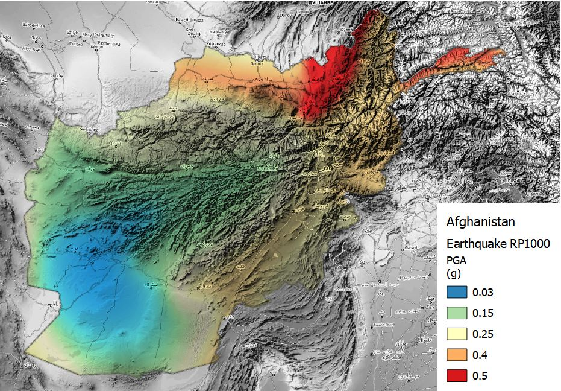

# Schema reference

The schema provides the authoritative definition of the structure of Risk Data Library Standard (RDLS) data, the meaning of each field, and the rules that must be followed to publish RDLS data. It is used to validate the structure and format of RDLS data.

For this version of RDLS, the canonical URL of the schema is \[\]\](). Use the canonical URL to make sure that your software, documentation or other resources refer to the specific version of the schema with which they were tested.

This page presents the schema in tables with additional information in paragraphs. You can also [view the schema in an interactive browser](browser.md) or [download it as JSON Schema](../../docs/_readthedocs/html/rdl_schema_0.1.json).

```{note}
   If any conflicts are found between the text on this page and the text within the schema, the text within the schema takes precedence.
```

The RDLS schema covers [dataset attributes](#dataset), [resource attributes](#resource) and four components to document data used in risk analysis:

- [Hazard](#hazard): metadata to describe hazard data, including the main hazard type and process, triggering hazard and process, hazard intensity units, occurrence frequency of individual events, multiple hazard footprints per event, historical and stochastic events sets, and analytical methods used.
- [Exposure](#exposure): metadata describing exposure data, including asset category (including human, built environment assets and natural assets), taxonomy scheme used to describe characteristics of assets and people, cost type, location and geometry types.
- [Vulnerability](#vulnerability): metadata to describe vulnerability and fragility relationships and indexes, including type of impact, type of exposure, hazard intensity measure and approach used to develop the relationship. This component uses attributes consistent with the hazard, exposure and loss components.
- [Loss](#loss): metadata describing monetary and non-monetary damage and losses produced in a risk assessment. This includes fields to link losses to the hazard, exposure, and vulnerability components used in the analysis. The loss component enables description of common impact and risk metrics for direct and indirect impacts, for individual historical and hypothetical events, and for large events sets in year loss tables and event loss tables.

For general definitions of hazard, exposure, vulnerability and loss, please see the [Glossary](../glossary.md).

For fields that reference [sub-schemas](#sub-schemas), a link is provided to a table with details of the sub-schema. To see how the fields and sub-schemas fit together, consult the [schema browser](browser.md).

The diagram below shows the core relationships between schema components, and their core attributes.

```{eval-rst}
 .. mermaid::

  classDiagram
      Dataset -- Hazard
      Dataset -- Exposure
      Dataset -- Vulnerability
      Dataset -- Loss
      Dataset: -Project name
      Dataset: -Coverage
      Dataset: -Purpose
      Dataset: -Bibliography
      class Hazard{
        -Type, Process
        -Trigger
        -Frequency, Intensity
        -Analytical method
          }
      class Exposure{
        -Asset category
        -Taxonomy
        -Cost type
      }
      class Vulnerability{
        -Hazard process
        -Exposure taxonomy
        -Analytical method
      }
      class Loss{
        -Hazard process
        -Exposure taxonomy
        -Loss frequency
        -Loss metric
      }          
```

## Dataset

In addition to schema-specific attributes, each dataset is identified by a list of attributes based on the [Dublin Core Metadata Initiative Metadata Terms](https://www.dublincore.org/specifications/dublin-core/dcmi-terms).

```{jsonschema} ../../docs/_readthedocs/html/rdl_schema_0.1.json
---
collapse: 
  publisher,spatial,resources,referenced_by,contact_point,creator,attributions,sources
addtargets:
---
```

## Resource

Other attributes are specific to individual resources, covering level of aggregation, resolution and format.

```{jsonschema} ../../docs/_readthedocs/html/rdl_schema_0.1.json
---
pointer: /$defs/Resource
collapse: temporal
addtargets:
---
```

## Hazard

The hazard component describes metadata about modeled natural hazards data, including hazard intensity footprints of historical or hypothetical events, return period hazard maps, hazard or susceptibility index, and stochastic event sets. The metadata defines the hazard type, physical process and intensity measures used in the dataset. Multiple hazards and processes (including cascading events) can be defined for each hazard, enabling users to describe dataset that contain, for example, earthquake ground shaking and liquefaction, and tsunami inundation triggered by the earthquake.

The hazard component uses hazard_type, process_type and intensity_measure consistent with the vulnerability and loss component’s of this standard. Spatial reference and location information are described using existing external standards. Temporal information can include date and duration of events or year of scenario, and is defined using the Dublin Core standards.

```{eval-rst}
 .. mermaid::

  classDiagram
      Event set -- Event1
      Event set -- Event2
      Event set: Hazard type
      Event set: Analytical method
      class Event1{
        Occurrence frequency
        Time reference
        Hazard trigger
      }
      class Event2{
        Occurrence frequency
        Time reference
        Hazard trigger
      }
      Event1 -- Footprint1
      Event1 -- Footprint2
      Event2 -- Footprint3
      Event2 -- Footprint4
      class Footprint1{
        Hazard process
        Intensity measure
        Uncertainty
      }
      class Footprint2{
        Hazard process
        Intensity measure
        Uncertainty
      }
      class Footprint3{
        Hazard process
        Intensity measure
        Uncertainty
      }
      class Footprint4{
        Hazard process
        Intensity measure
        Uncertainty
      }
```

`````{tab-set}

````{tab-item} Schema

```{jsonschema} ../../docs/_readthedocs/html/rdl_schema_0.1.json
---
pointer: /anyOf/0/properties/hazard
collapse: event_sets/0/hazards,event_sets/0/spatial,event_sets/0/temporal,event_sets/0/events
addtargets:
---
```

````

````{tab-item} Examples

Hazard data are most often represented by geospatial grids (raster); sometimes they are represented by points or polygons.

**Flood hazard maps for Kabul**

Schema attributes for flood hazard map related to the occurrence probability of a river flood event with a return period of once in 100 years over Kabul, Afghanistan. The hydrological data used for modelling the intensity of floods is derived from observations over the period 1958-2001 (44 years). The hazard intensity is measured as water depth, in meters. These information cover all mandatory fields, and a few optional fields.


| **Required** | **Attribute**           | **Example**     |
| :----------: | ----------------------- | --------------- |
|      \*      | Hazard type             | Flood           |
|      \*      | Analysis type           | Probabilistic   |
|      \*      | Calculation method      | Simulated       |
|              | Geographic area         | Kabul           |
|              | Frequency type          | Return Period   |
|              | Occurrence probability  | 100 years       |
|              | Occurrence time (start) | 1958            |
|              | Occurrence time (end)   | 2001            |
|              | Occurrence time (span)  | 44 years        |
|      \*      | Hazard process          | River flood     |
|      \*      | Unit of measure         | Water depth (m) |

**Earthquake hazard maps for Afghanistan**

Schema attributes for an earthquake hazard map related to an occurrence probability of an event with return period of once in 1000 years over Afghanistan. The seismic data catalogue behind the calculation of occurrence probability starts from year 800, covering a period of 1200 years. The hazard intensity is measured as Peak Ground Acceleration, expressed in (g).



| **Required** | **Attribute**           | **Example**   |
| :----------: | ----------------------- | ------------- |
|      \*      | Hazard type             | Earthquake    |
|      \*      | Analysis type           | Probabilistic |
|      \*      | Calculation method      | Simulated     |
|              | Frequency type          | Return Period |
|              | Occurrence probability  | 1000 years    |
|              | Occurrence time (start) | 800           |
|              | Occurrence time (end)   | 2001          |
|              | Occurrence time (span)  | 1200 years    |
|      \*      | Hazard process          | Ground motion |
|      \*      | Unit of measure         | PGA (g)       |


````

`````

## Exposure

The exposure component describes metadata for datasets containing information on the distribution and characteristics of built environment assets (buildings and infrastructure) and natural assets and population, that are used in risk assessment. The exposure component provides codelists to describe the type of assets and costs, and the taxonomy scheme that is used to describe construction and demographic information contained in the dataset.

The exposure component uses exposure categories consistent with the vulnerability and loss components of this standard. Spatial reference and location information are described using existing external standards. Temporal information can include date and duration of events or year of scenario, and is defined using the Dublin Core standards.

```{eval-rst}
 .. mermaid::

  classDiagram
      Model -- Asset1
      Model -- Asset2
      Model: Category
      Model: Occupancy
      class Asset1{
        Taxonomy code
        Value type
        Value unit
      }
      class Asset2{
        Taxonomy code
        Value type
        Value unit
      }
```

`````{tab-set}

````{tab-item} Schema

```{jsonschema} ../../docs/_readthedocs/html/rdl_schema_0.1.json
---
pointer: /anyOf/1/properties/exposure
collapse: cost
addtargets:
---
```

````

````{tab-item} Examples

Exposure data can be stored at multiple scales, more often using vectors, namely polygons (e.g. building footprint), points (e.g. asset geolocation) and lines (e.g. transport infrastructures, lifelines), but in same case exposure estimates are aggregated at ADM level or distributed over a raster grid.

**Exposure map for Kabul**

Two exposure datasets are shown together in the example: building footprints polygons and population density raster at 90 m resolution.


| **Required** | **Attribute**       | **Example** |
| :----------: | ------------------- | ----------- |
|      \*      | Geographic coverage | Afghanistan |
|      \*      | Exposure category   | Buildings   |
|      \*      | Occupancy           | Mixed       |
|              | Taxonomy            | OSM         |
|      \*      | Value type          | Structure   |
|      \*      | Unit of measure     | USD         |

| **Required** | **Attribute**       | **Example** |
| :----------: | ------------------- | ----------- |
|      \*      | Geographic coverage | Afghanistan |
|      \*      | Exposure category   | Indicators  |
|      \*      | Occupancy           | Residential |
|              | Period of occupancy | Night       |
|      \*      | Value type          | Other       |
|      \*      | Unit of measure     | Count       |


````

`````

## Vulnerability

The vulnerability component describes metadata for datasets that detail fragility, damage-to-loss and vulnerability relationships and indexes for physical damage and social vulnerability that are used in risk analysis. It contains key information including the type of function, intensity and impact metrics used, which asset types or population groups it applies to, how it was developed and for what locations.

The vulnerability component uses hazard_type, process_type and intensity_measure consistent with the hazard and loss components, exposure information consistent with the exposure and loss components. Spatial reference and location information are described using existing external standards.

```{eval-rst}
 .. mermaid::

  classDiagram
      Model -- Specifics
      Model -- Additional
      Model: Hazard type
      Model: Exposure taxonomy
      Model: Calculation method
      class Specifics{
        Parameters
        Damage states
        Intensity measure
      }
      class Additional{
        Validation
        Error
        Fitness
      }
```

`````{tab-set}

````{tab-item} Schema

```{jsonschema} ../../docs/_readthedocs/html/rdl_schema_0.1.json
---
pointer: /anyOf/2/properties/vulnerability
collapse: cost,impact,spatial,se_category
addtargets:
---
```

````

`````

## Loss

The loss component provides metadata describing data generated in risk assessments, i.e., modelled impacts and losses for single historical events or hypothetical scenarios and risk estimates from analysis of large event sets. The data can include monetary and non-monetary, and direct or indirect, impacts and losses.
Loss datasets can be explicitly linked to the exposure, hazard, and vulnerability datasets used in the analysis. This component uses descriptions of assets, hazards and impact types consistent with all other components of this standard. Spatial reference and location information are described using existing external standards. Temporal information can include date and duration of events or year of scenario, and is defined using the Dublin Core standards.

```{eval-rst}
 .. mermaid::

  classDiagram
      Model -- Map
      Model -- Curve
      Model: Hazard type
      Model: Exposure category
      Model: Calculation method
      Model: Link data

      class Map{
        Occurrence frequency
        Time reference
        Impact type
        Loss type
        Loss metric
        Loss unit
      }
      class Curve{
        Occurrence frequency
        Time reference
        Impact type
        Loss type
        Loss metric
        Loss unit
      }
```

`````{tab-set}

````{tab-item} Schema

```{jsonschema} ../../docs/_readthedocs/html/rdl_schema_0.1.json
---
pointer: /anyOf/3/properties/loss
collapse: cost,impact
addtargets:
---
```

````

````{tab-item} Examples

Losses can be represented in many different way: regular raster grids, points, or polygons. Often, the loss data consist of measures aggregated at the administrative unit level.

**Flood loss scenarios for Afghanistan, 2050**

Schema attributes for loss map related to future river flood hazard scenarios (2050) over all types of exposure occupancies for Afghanistan.


The losses are higher in the most densely built-up area of Kabul.


| **Required** | **Attribute**          | **Example**                                                             |
| :----------: | ---------------------- | ----------------------------------------------------------------------- |
|      \*      | Hazard type            | Flood                                                                   |
|              | Hazard process         | River flood                                                             |
|      \*      | Exposure occupancy     | Mixed                                                                   |
|      \*      | Exposure category      | Buildings                                                               |
|      \*      | Value type             | Structure                                                               |
|              | Hazard link            | [Dataset](http://jkan.riskdatalibrary.org/datasets/hzd-afg-fl-baseline) |
|              | Exposure link          |                                                                         |
|              | Vulnerability link     |                                                                         |
|              | Time year              | 2050                                                                    |
|              | Frequency type         | Return Period                                                           |
|              | Occurrence probability | RP 5-1000 years                                                         |
|      \*      | Impact                 | Direct                                                                  |
|      \*      | Loss type              | Ground up                                                               |
|      \*      | Metric                 | Average Annual Losses                                                   |
|      \*      | Unit                   | USD                                                                     |

______________________________________________________________________

Losses can be investigated as total or for individual exposed asset and infrastructure elements.


______________________________________________________________________

**Observed losses**

Insert example of recorded empirical losses.

| **Required** | **Attribute**           | **Example**   |
| :----------: | ----------------------- | ------------- |
|      \*      | Hazard type             | Earthquake    |
|      \*      | Analysis type           | Probabilistic |
|      \*      | Calculation method      | Simulated     |
|              | Frequency type          | Return Period |
|              | Occurrence probability  | 1000 years    |
|              | Occurrence time (start) | 800           |
|              | Occurrence time (end)   | 2001          |
|              | Occurrence time (span)  | 1200 years    |
|      \*      | Hazard process          | Ground motion |
|      \*      | Unit of measure         | PGA (g)       |


````

`````

## Sub-schemas

### Entity

`Entity` is defined as:

```{jsoninclude-quote} ../../docs/_readthedocs/html/rdl_schema_0.1.json
---
jsonpointer: /$defs/Entity/description
---
```

Each `Entity` has the following fields:

```{jsonschema} ../../docs/_readthedocs/html/rdl_schema_0.1.json
---
pointer: /$defs/Entity
collapse: name,email,url
addtargets:
---
```

### Attribution

`Attribution` is defined as:

```{jsoninclude-quote} ../../docs/_readthedocs/html/rdl_schema_0.1.json
---
jsonpointer: /$defs/Attribution/description
---
```

Each `Attribution` has the following fields:

```{jsonschema} ../../docs/_readthedocs/html/rdl_schema_0.1.json
---
pointer: /$defs/Attribution
collapse: id,entity,role
addtargets:
---
```

### Related_resource

`Related_resource` is defined as:

```{jsoninclude-quote} ../../docs/_readthedocs/html/rdl_schema_0.1.json
---
jsonpointer: /$defs/Related_resource/description
---
```

Each `Related_resource` has the following fields:

```{jsonschema} ../../docs/_readthedocs/html/rdl_schema_0.1.json
---
pointer: /$defs/Related_resource
collapse: id,name,authorNames,datePublished,url,doi
addtargets:
---
```

### Source

`Source` is defined as:

```{jsoninclude-quote} ../../docs/_readthedocs/html/rdl_schema_0.1.json
---
jsonpointer: /$defs/Source/description
---
```

Each `Source` has the following fields:

```{jsonschema} ../../docs/_readthedocs/html/rdl_schema_0.1.json
---
pointer: /$defs/Source
collapse: id,name,url,type,component
addtargets:
---
```

### Period

`Period` is defined as:

```{jsoninclude-quote} ../../docs/_readthedocs/html/rdl_schema_0.1.json
---
jsonpointer: /$defs/Period/description
---
```

Each `Period` has the following fields:

```{jsonschema} ../../docs/_readthedocs/html/rdl_schema_0.1.json
---
pointer: /$defs/Period
collapse: start,end,duration
addtargets:
---
```

### Location

`Location` is defined as:

```{jsoninclude-quote} ../../docs/_readthedocs/html/rdl_schema_0.1.json
---
jsonpointer: /$defs/Location/description
---
```

Each `Location` has the following fields:

```{jsonschema} ../../docs/_readthedocs/html/rdl_schema_0.1.json
---
pointer: /$defs/Location
collapse: countries,gazetteerEntries,bbox,geometry,centroid,scale
addtargets:
---
```

### Gazetteer_entry

`Gazetteer_entry` is defined as:

```{jsoninclude-quote} ../../docs/_readthedocs/html/rdl_schema_0.1.json
---
jsonpointer: /$defs/Gazetteer_entry/description
---
```

Each `Gazetteer_entry` has the following fields:

```{jsonschema} ../../docs/_readthedocs/html/rdl_schema_0.1.json
---
pointer: /$defs/Gazetteer_entry
collapse: id,scheme,description,uri
addtargets:
---
```

### Geometry

`Geometry` is defined as:

```{jsoninclude-quote} ../../docs/_readthedocs/html/rdl_schema_0.1.json
---
jsonpointer: /$defs/Geometry/description
---
```

Each `Geometry` has the following fields:

```{jsonschema} ../../docs/_readthedocs/html/rdl_schema_0.1.json
---
pointer: /$defs/Geometry
collapse: type,coordinates
addtargets:
---
```

### Hazard

`Hazard` is defined as:

```{jsoninclude-quote} ../../docs/_readthedocs/html/rdl_schema_0.1.json
---
jsonpointer: /$defs/Hazard/description
---
```

Each `Hazard` has the following fields:

```{jsonschema} ../../docs/_readthedocs/html/rdl_schema_0.1.json
---
pointer: /$defs/Hazard
collapse: id,type,processes,intensity_measure,trigger
addtargets:
---
```

### Trigger

`Trigger` is defined as:

```{jsoninclude-quote} ../../docs/_readthedocs/html/rdl_schema_0.1.json
---
jsonpointer: /$defs/Trigger/description
---
```

Each `Trigger` has the following fields:

```{jsonschema} ../../docs/_readthedocs/html/rdl_schema_0.1.json
---
pointer: /$defs/Trigger
collapse: type,processes
addtargets:
---
```

### Event_set

`Event_set` is defined as:

```{jsoninclude-quote} ../../docs/_readthedocs/html/rdl_schema_0.1.json
---
jsonpointer: /$defs/Event_set/description
---
```

Each `Event_set` has the following fields:

```{jsonschema} ../../docs/_readthedocs/html/rdl_schema_0.1.json
---
pointer: /$defs/Event_set
collapse: 
  id,hazards,analysis_type,frequency_distribution,seasonality,calculation_method,event_count,occurrence_range,spatial,temporal,events
addtargets:
---
```

### Event

`Event` is defined as:

```{jsoninclude-quote} ../../docs/_readthedocs/html/rdl_schema_0.1.json
---
jsonpointer: /$defs/Event/description
---
```

Each `Event` has the following fields:

```{jsonschema} ../../docs/_readthedocs/html/rdl_schema_0.1.json
---
pointer: /$defs/Event
collapse: 
  id,disaster_identifier,calculation_method,hazard,occurrence,description,footprints
addtargets:
---
```

### Footprint

`Footprint` is defined as:

```{jsoninclude-quote} ../../docs/_readthedocs/html/rdl_schema_0.1.json
---
jsonpointer: /$defs/Footprint/description
---
```

Each `Footprint` has the following fields:

```{jsonschema} ../../docs/_readthedocs/html/rdl_schema_0.1.json
---
pointer: /$defs/Footprint
collapse: id,intensity_measure,data_uncertainty
addtargets:
---
```

### Cost

`Cost` is defined as:

```{jsoninclude-quote} ../../docs/_readthedocs/html/rdl_schema_0.1.json
---
jsonpointer: /$defs/Cost/description
---
```

Each `Cost` has the following fields:

```{jsonschema} ../../docs/_readthedocs/html/rdl_schema_0.1.json
---
pointer: /$defs/Cost
collapse: id,type,unit
addtargets:
---
```

### Probabilistic

`Probabilistic` is defined as:

```{jsoninclude-quote} ../../docs/_readthedocs/html/rdl_schema_0.1.json
---
jsonpointer: /$defs/Probabilistic/description
---
```

Each `Probabilistic` has the following fields:

```{jsonschema} ../../docs/_readthedocs/html/rdl_schema_0.1.json
---
pointer: /$defs/Probabilistic
collapse: return_period,event_rate,probability
addtargets:
---
```

### Impact

`Impact` is defined as:

```{jsoninclude-quote} ../../docs/_readthedocs/html/rdl_schema_0.1.json
---
jsonpointer: /$defs/Impact/description
---
```

Each `Impact` has the following fields:

```{jsonschema} ../../docs/_readthedocs/html/rdl_schema_0.1.json
---
pointer: /$defs/Impact
collapse: type,metric,unit,base_data_type
addtargets:
---
```

### Classification

`Classification` is defined as:

```{jsoninclude-quote} ../../docs/_readthedocs/html/rdl_schema_0.1.json
---
jsonpointer: /$defs/Classification/description
---
```

Each `Classification` has the following fields:

```{jsonschema} ../../docs/_readthedocs/html/rdl_schema_0.1.json
---
pointer: /$defs/Classification
collapse: scheme,id,description,uri
addtargets:
---
```
