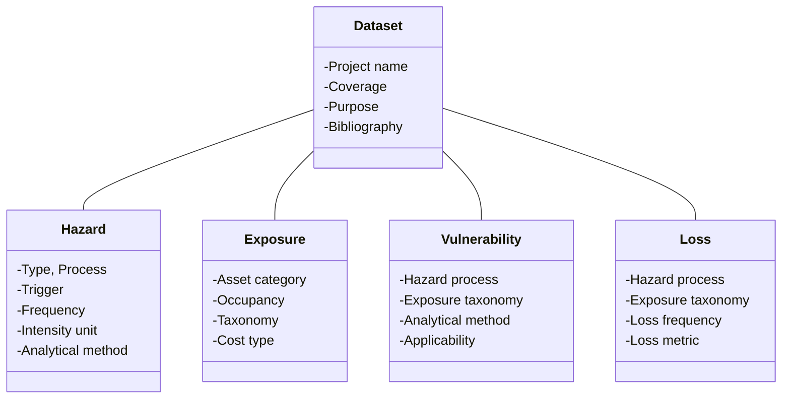

# Overview of standard data model

Following [key concepts](keyconcepts.md), the Risk Data Library Standard schema includes four components:

- [**Hazard**](hazard.md): main hazard type, specific process, trigger of the hazard, occurrence frequency of event, intensity unit to measure the process and analytical method.
- [**Exposure**](exposure.md): asset category, occupancy and specific taxonomy, cost type and value.
- [**Vulnerability**](vulnerability.md): model that links hazard intensity and exposure classification to measure of impact over the total exposed value.
- [**Loss**](loss.md): modelled damage and losses produced in a risk assessment as a function of hazard, exposure and vulnerability components.
</ul>

The diagram below shows the core relationships between schema components, rather than listing all of their attributes.

 
##Dataset general attributes

In addition to schema-specific attributes, each dataset is identified by a list of attributes based on <a href="https://www.dublincore.org/specifications/dublin-core/dcmi-terms">DublinCore metadata standard</a>.

| **Required** | **Attribute** | **Description** | **Type** |
|:---:|---|---|---|
|*| Component | Schema to be used | <ul><li>Hazard<li>Exposure<li>Vulnerability<li>Loss |
|*| Source model | Name of source model | Text |
|*| Release date | Model release date | Date |
| | Project name | Project under which data has been produced | Text |
| | Purpose | Purpose for what the data has been produced | Text |
| | Notes | Additional details about the dataset | Text |
| | Bibliography | Author, titles and publication year of documents containing relevant information on the dataset | Authors (Year) - Title; URL |
| | Version | Version of the dataset | Number  |
|*| Geo coverage | ISO code(s) of countries covered | ISOa3 country code |
|*| License code | Type of license | Licensing options |

 
Other attributes are specific to individual resources, covering level of aggregation, resolution and format.

| **Required** | **Attribute** | **Type** |
|:---:|---|---|
|*| Resource name | Text |
|*| Aggregation type | <ul><li>Footprints<li>Grid<li>Administrative boundaries<li>Points or lines<li>N/A</ul> |
| | Description | Text |
| | Reference coordinate system | CRS EPSG |
| | Horizontal resolution | n unit |
| | Format | ext |
| | Download Url | url |

 

