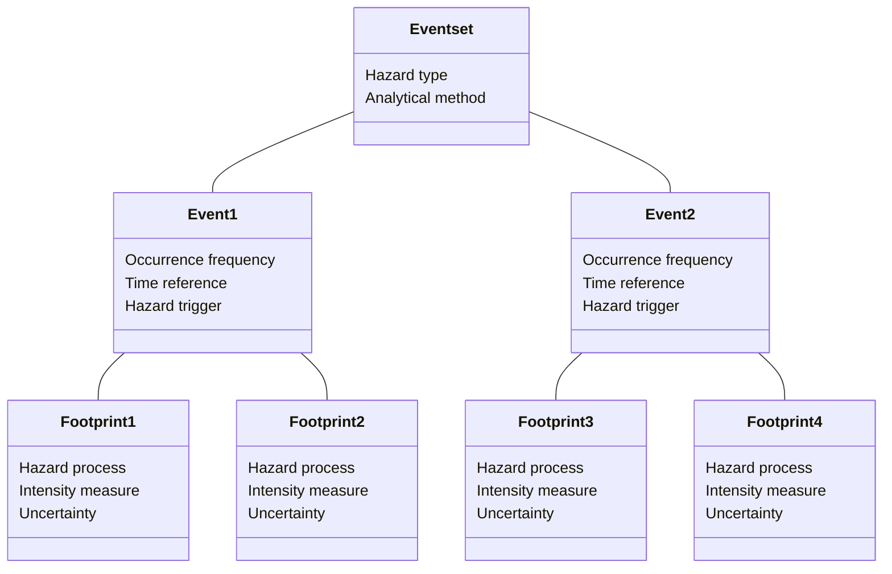
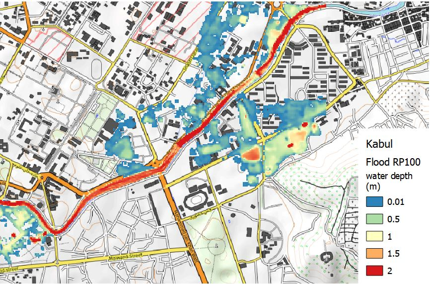
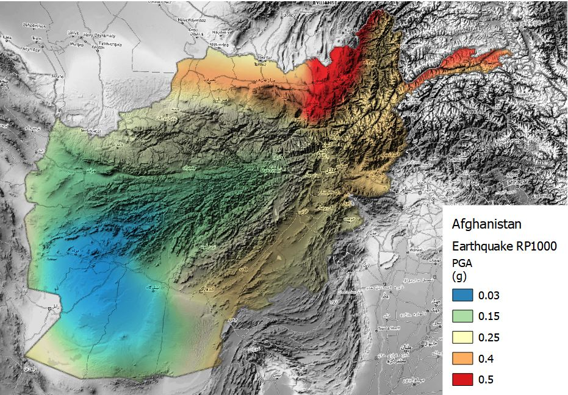

# Hazard
## Schema attributes
The hazard schema stores data about the intensity and occurrence probability of physical hazard phenomena such as floods, eartquakes, wildfires or others. The specific hazard process can be defined and measured with a specific intensity unit. For example, earthquake hazard may be represented as ground shaking, liquefaction or ground displacement.

 
The schema specifies which type of analysis and data methodology that has generated the dataset. It supports either simulated probabilistic scenarios and empirical observations. If the dataset has been produced for a specific location, such a city, the name of the location can be included.

|**Required**| **Attribute** | **Description** | **Type** |
|:---:| --- | --- | --- |
|*| Hazard type | Main hazard type from list of options | <ul><li>Coastal Flood<li>Convective Storm<li>Drought<li>Earthquake<li>Extreme Temperature<li>Flood<li>Landslide<li>Tsunami<li>Volcanic<li>Wildfire<li>Strong Wind<li>Multi-Hazard</ul> |
|*| Analysis type | Type of analysis that generated the data | <ul><li>Deterministic<li>Probabilistic |
|*| Calculation method | The methodology used for the modelling of hazard | <ul><li>Simulated<li>Observed<li>Inferred |
|| Geographic area | Specific location for which the dataset has been developed | Name of location |

 When the scenario modelled refers to a specific period of time, this can be specified in terms of dates, period span and reference year. For example, an observed flood event that occurred from 1.10.2009 (time start) to 3.10.2009 (time end), spanning over 3 days (time span). When precise time collocation is unknow or inapplicabile, a general reference date such as "2009" is used to identify events (time year). This is also useful to specify future scenario, e.g. time year: 2050.

|**Required**| **Attribute** | **Description** | **Type** |
|:---:| --- | --- | --- |
|| Time start | The time at which the modelled scenario starts | Date |
|| Time end | The time at which the modelled scenario ends | Date |
|| Time span | The duration of the modelled period | Number |
|| Time year | One reference year to univocally identify the scenario | Date (year) |

 When instead the hazard scenario is represented in probabilistic terms, the occurrence probability (frequency distribution) of hazard can be expressed in different ways. The most common way to communicate this is the "return period", expressed as the number of years after which a given hazard intensity could occurr again: RP 100 indicates that that event has a probability of once in 100 years. This attirbute can indicate individual layer frequency (RP100) or a range of frequencies for a collection of layers (RP10-100) The probability of occurrence is usually calculated on the basis of a reference period that provides observations: this period can be specified by start date, end date and time span. For example, an analysis of eartquake frequency based on seismic observations from 1934 (occurrence time start) to 2001 (occurrence time end), for a total count of 66 years (occurrence time span).

|**Required**| **Attribute** | **Description** | **Type** |
|:---:| --- | --- | --- |
|| Frequency type | The frequency of occurrence of the present event | <ul><li>Rate of Exceedence<li>Probability of Exceedence<li>Return Period</ul> |
|| Occurrence probability | For probabilistic scenario, the occurrence probability is expressed according to frequency type | Text |
|| Occurence time (start) | Start date of the period used to infer the occurrence probability | Date (year) |
|| Occurence time (end) | End date of the period used to specify the occurrence probability | Date (year) |
|| Occurence time (span) | The duration of the period used to specify the occurrence probability | Number of years |

 The schema distinguish between the hazard and process represented and the hazard and process identified as the cause, or concause for the manifestation of the represented hazard. For example, a dataset represent landslide hazard that is triggered by an earthquake will have Hazard type: Landslide; Trigger hazard type: Earthquake. The unit of measure refers to the represented hazard and process. A description can be added to cover additional information not included in the schema.

|**Required**| **Attribute** | **Description** | **Type** |
|:---:| --- | --- | --- |
|| Trigger hazard type | The hazard type that has triggered the event (if any) | Hazard type |
|| Trigger process type |  The process type that triggered the event (if any) | Process type |

 The hazard dataset could include one or more footprints for the same event, where each is one possible realisation (i.e. one footprint could represent minimum, another footprint the average and another one the maximum). The event uncertainty can be represented explicitly, through the inclusion of multiple footprints per event.

|**Required**| **Attribute** | **Description** | **Type** |
|:---:| --- | --- | --- |
|*| Hazard process | Specific hazard process | Process type |
|*| Unit of measure | Intensity measure of the process | Option list |
|| Description | Provides additional information about a specific event | Text |
|| Data uncertainty | The typology of uncertainty, if considered | Text |

 Below is the list of all hazards and related process types:

| **Hazard type** | **Process type** |
|---|---|
| Coastal Flood | Coastal Flood |
| Coastal Flood | Storm Surge |
| Convective Storm | Tornado |
| Drought | Agricultural Drought |
| Drought | Hydrological Drought |
| Drought | Meteorological Drought |
| Drought | Socio-economic Drought |
| Earthquake | Primary Rupture |
| Earthquake | Secondary Rupture |
| Earthquake | Ground Motion |
| Earthquake | Liquefaction |
| Extreme Temperature | Extreme cold |
| Extreme Temperature | Extreme heat |
| Flood | Fluvial Flood |
| Flood | Pluvial Flood |
| Landslide | Landslide |
| Landslide | Snow Avalanche |
| Tsunami | Tsunami |
| Volcanic | Ashfall |
| Volcanic | Ballistics |
| Volcanic | Proximal hazards |
| Volcanic | Lahar |
| Volcanic | Lava |
| Volcanic | Pyroclastic Flow |
| Wildfire | Wildfire |
| Strong Wind | Extratropical cyclone |
| Strong Wind | Tropical cyclone |

 

##Examples

Hazard data are most often represented by geospatial grids (raster); sometimes they are represented by points or polygons.

###Flood hazard maps for Kabul

Schema attributes for flood hazard map related to occurrence probability of a river flood event with a return period of once in 100 years over Kabul, Afghanistan. The hydrological data used for modelling the intensity of floods is derived from observations over the period 1958-2001 (44 years). The hazard intensity is measured as water depth, in meters. These information cover all mandatory fields, and few optional fields.

|**Required**| **Attribute** | **Example** |
|:---:| --- | --- |
|*| Hazard type | Flood |
|*| Analysis type | Probabilistic |
|*| Calculation method | Simulated |
|| Geographic area | Kabul |
|| Frequency type | Return Period |
|| Occurrence probability | 100 years |
|| Occurence time (start) | 1958 |
|| Occurence time (end) | 2001 |
|| Occurence time (span) | 44 years |
|*| Hazard process | River flood |
|*| Unit of measure | Water depth (m) |

 

###Earthquake hazard maps for Afghanistan
Schema attributes for earthquake hazard map related to occurrence probability of an event with return period of  once in 1000 years over Afghanistan. The seismic data catalogue behind the calculation of occurrence probability start from year 800, covering a period of 1200 years. The hazard intensity is measured as Peak Ground Acceleration, expressed in (g).

|**Required**| **Attribute** | **Example** |
|:---:| --- | --- |
|*| Hazard type | Earthquake |
|*| Analysis type | Probabilistic |
|*| Calculation method | Simulated |
|| Frequency type | Return Period |
|| Occurrence probability | 1000 years |
|| Occurence time (start) | 800 |
|| Occurence time (end) | 2001 |
|| Occurence time (span) | 1200 years |
|*| Hazard process | Ground motion |
|*| Unit of measure | PGA (g) |

 

