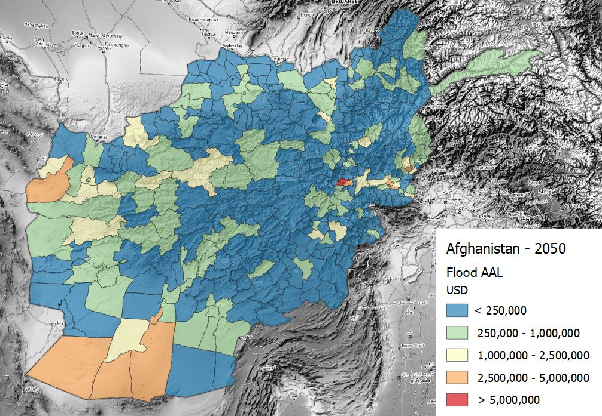
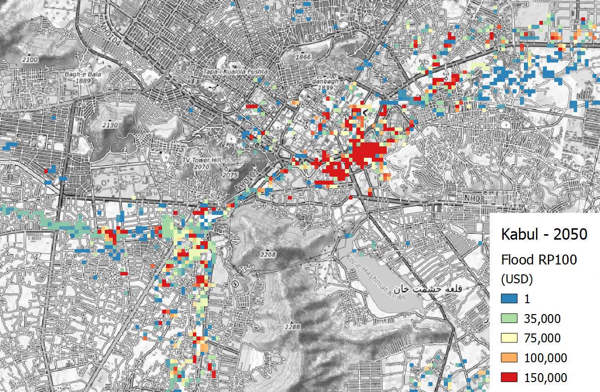

# Loss
## Schema attributes
The loss schema enables to store information about hazard impact over exposure as a function of vulnerability. Loss datasets are directly linked to the hazard, exposure, and vulnerability datasets which were used to model losses. When no vulnerability model is applied, the potential loss is estimated as the sum of all exposed value. Losses can be expressed in form of map or in form of a curve, both sharing the same attributes and metrics.

The main attributes of the **loss model** describe the hazard and process for which the loss are calculated, the method of calculation (to discern empirical events from simulated scenarios) and the category of asset on which losses insist. The schema includes the direct links to the original dataset of hazard, exposure, and vulnerability that were used to calculate the loss.

|**Required**| **Attribute** | **Description** | **Type** |
|:---:| --- | --- | --- |
|*| Hazard type | Main hazard type from list of options | <ul><li>Coastal Flood<li>Convective Storm<li>Drought<li>Earthquake<li>Extreme Temperature<li>Flood<li>Landslide<li>Tsunami<li>Volcanic<li>Wildfire<li>Strong Wind<li>Multi-Hazard</ul> |
| | Hazard process | Specific hazard process | Options list |
| | Calculation method | How the scenario was calculated | <ul><li>Inferred<li>Simulated<li>Observed |
|*| Exposure occupancy | Destination of use of the asset | <ul><li>Residential<li>Commercial<li>Industrial<li>Infrastructure<li>Healthcare<li>Educational<li>Government<li>Crop<li>Livestock<li>Forestry<li>Mixed</ul> |
|*| Exposure category | Category of asset suffering the losses | <ul><li>Buildings<li>Indicators<li>Infrastructures<li>Crops, livestock and forestry</ul> |
|*| Value type | Element on which loss insist | <ul><li>Structure<li>Content<li>Product<li>Other</ul> |
| | Hazard link | Hazard dataset that was used to calculate loss | URL |
| | Exposure link | Exposure dataset that was used to calculate loss | URL |
| | Vulnerability link | Vulnerability dataset that was used to calculate loss | URL |

 When the scenario modelled refers to a specific period of time, this can be specified in terms of dates, period span and reference year. For example, an observed flood event that occurred from 1.10.2009 (time start) to 3.10.2009 (time end), spanning over 3 days (time span). When precise time collocation is unknow or inapplicabile, a general reference date such as "2009" is used to identify events (time year). This is also useful to specify future scenario, e.g. time year: 2050.

|**Required**| **Attribute** | **Description** | **Type** |
|:---:| --- | --- | --- |
|| Time start | The time at which the modelled scenario starts | Date |
|| Time end | The time at which the modelled scenario ends | Date |
|| Time span | The duration of the modelled period | Number |
|| Time year | One reference year to univocally identify the scenario | Date (year) |

 When instead the hazard scenario is represented in probabilistic terms, the occurrence probability (frequency distribution) of hazard can be expressed in different ways. The most common way to communicate this is the "return period", expressed as the number of years after which a given hazard intensity could occurr again: RP 100 indicates that that event has a probability of once in 100 years. This attirbute can indicate individual layer frequency (RP100) or a range of frequencies for a collection of layers (RP10-100).

|**Required**| **Attribute** | **Description** | **Type** |
|:---:| --- | --- | --- |
|| Frequency type | The frequency of occurrence of the present event | <ul><li>Rate of Exceedence<li>Probability of Exceedence<li>Return Period</ul> |
|| Occurrence probability | For probabilistic scenario, the occurrence probability is expressed according to frequency type | Text |

 Additional attributes are specific to loss, describing the type of impact, the type of loss, the loss metric and the unit used to measure it.

|**Required**| **Attribute** | **Description** | **Type** |
|:---:| --- | --- | --- |
|*| Impact | The type of impact | <ul><li>Direct<li>Indirect<li>Total |
|*| Loss type | The type of loss | <ul><li>Ground up<li>Insured</ul> |
|*| Metric | Type of loss metric | <ul><li>Average Annual Losses<li>Annual Average Loss Ratio<li>Probable Maximal Loss |
|*| Unit | Cost unit of measure | Unit code |

 

##Examples

Losses can be rapresented in many different way: regular raster grids, points, or polygons. Often, the loss data consist of measures aggregated at the administrative unit level.

###Flood loss scenarios for Afghanistan, 2050

Schema attributes for loss map related to future river flood hazard scenarios (2050) over all types of exposure occupancies for Afghanistan.

The losses are higher in the most densely built-up area of Kabul.

|**Required**| **Attribute** | **Example** |
|:---:| --- | --- |
|*| Hazard type | Flood |
| | Hazard process | River flood |
|*| Exposure occupancy | Mixed |
|*| Exposure category | Buildings |
|*| Value type | Structure |
| | Hazard link | [Dataset](http://jkan.riskdatalibrary.org/datasets/hzd-afg-fl-baseline) |
| | Exposure link |  |
| | Vulnerability link |  |
| | Time year | 2050 |
| | Frequency type | Return Period |
| | Occurrence probability | RP 5-1000 years |
|*| Impact | Direct |
|*| Loss type | Ground up |
|*| Metric | Average Annual Losses |
|*| Unit | USD |

 

Losses can be investigated as total or for individual exposed asset and infrastructure elements.

 

###Observed losses

Insert example of recorded empirical losses.

|**Required**| **Attribute** | **Example** |
|:---:| --- | --- |
|*| Hazard type | Earthquake |
|*| Analysis type | Probabilistic |
|*| Calculation method | Simulated |
|| Frequency type | Return Period |
|| Occurrence probability | 1000 years |
|| Occurence time (start) | 800 |
|| Occurence time (end) | 2001 |
|| Occurence time (span) | 1200 years |
|*| Hazard process | Ground motion |
|*| Unit of measure | PGA (g) |

 
