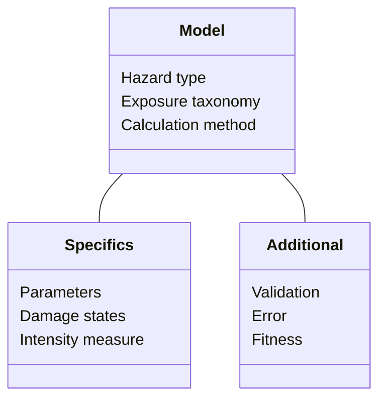

# Vulnerability
## Schema attributes

The vulnerability schema includes physical fragility and vulnerability relationships in relation to specific hazards or for multi-hazard (combination of individual hazards). A wide range of model types and parameters can describe vulnerability, for this reason there are many possible variables accounted by the Vulnerability schema. But only a part of them will be required to describe one specific model.
The schema distinguishes key information describing the vulnerabilirt model, including:

- function type (i.e fragility, vulnerability, damage-to-loss)
- countries the function was developed for, measured in terms of to geographic relevance
- development approach (empirical, analytical, judgement, hybrid, code-based)
- mathematical model used (including exponential, cumulative lognormal/normal)
- the intensity measure and asset type the function relates to
- loss parameter / engineering demand parameter values

The **model** attributes specify which hazard types and exposure categories the vulnerability relationship applies to.
Other attributes describe the function type and the analytical approach adopted, and add notes on the model applicability in terms of location and scale.

|**Required**| **Attribute** | **Description** | **Type** |
|:---:| --- | --- | --- |
|*| Primary hazard | Main hazard type from list of options | Hazard list |
| | Secondary hazard | Secondary hazard type from list of options | Hazard list |
|*| Primary process | Primary hazard process from list of options | Process list |
| | Secondary process | Secondary hazard process from list of options | Process list |
|*| Frequency | Frequency representation type | <ul><li>Rate of Exceedence<li>Probability of Exceedence<li>Return Period</ul> |
|*| Intensity unit | Unit to measure hazard intensity | Option list |
|*| Exposure category | Frequency representation type | <ul><li>Buildings<li>Indicators<li>Infrastructures<li>Crops, livestock and forestry</ul> |
|*| Exposure occupancy | Type of occupancy to which function applies | <ul><li>Residential<li>Commercial<li>Industrial<li>Infrastructure<li>Healthcare<li>Educational<li>Government<li>Crop<li>Livestock<li>Forestry<li>Mixed</ul> |
| | Taxonomy source | Name of exposure taxonomy | Text |
| | Taxonomy code | Name of taxonomy | Taxonomy code to which function applies | Text |
| * | Impact type | Type of impact | <ul><li>Direct<li>Indirect<li>Total</ul> |
| * | Function type | Type of function | <ul><li>Fragility<li>Vulnerability<li>Damage-to-Loss</ul> |
| | Approach | Type of methodological approach | <ul><li>Empirical<li>Analytical<li>Judgement<li>Hybrid</ul> |
| * | | Relationship type | Type of relationship | <ul><li>Mathematical<li>Discrete</ul> |
| | Mathematical model | Type of mathematical model | <ul><li>Parametric<li>Bespoke</ul> |
| * | Scale applicability | At which spatial scale the function applies | <ul><li>Individual items<li>Aggregated to grid<li>Aggregated to boundaries<li>N/A |
| * | Transferrability | List of countries in which the model could be applied | ISOa3 code |
| * | Local applicability | Specific sub-area within a country or region to wich the model specifically applies | Location name |
| | Transferrability notes | Details about applicability to different areas | Text |

 
The **specifics** attributes add more optional details.

| | **Field name** | **Description** | **Example** |
|:---:| --- | --- | --- | 
| | par\_names | Parameters values names | MIDR , Ash depth | |
| | ub\_par\_value | Upper bound parameters value (Value1; Value2) | |
| | ub\_par\_perc | Upper bound parameters percentiles (Perc1; Perc2) | |
| | med\_par\_value | Median parameter values (Med1; Med2) | |
| | lb\_par\_value | Lower bound parameters value (Value1; Value2) | |
| | lb\_par\_perc | Lower bound parameters percentiles (Perc 1;Perc 2) | |
| | damage\_scale\_code | Code that identifies the damage scale | |
| | dm\_state\_name | Damage states studied in the reference study of the function | |
| | n\_dm\_states | Number of damage states studied in the reference study of the function | |
| | f\_disc\_im | Intensity measure values for the characterization of discrete functions | |
| | f\_disc\_ep | This field lists the associated exceeded probability values to the IM values of the previous field | |
| | lp\_code |  |  |
| | lp\_loss\_value | | |
| | edp\_code | Code related to specific engineering demand parameter (EDP) used to the DS thresholds | |
| | edp\_name | Specific engineering demand parameter (EDP) used to the DS thresholds | |
| | edp\_dmstate\_thre | Specific damage state EDP threshold | | 
| | im\_code | Code of intensity measure | |
| | im\_name | Name of intensity measure | |
| | im\_range | Range of intensity measures as min;max (e.g. 0;500) | |
| | im\_units | Unit of intensity measure | |
| | im\_method | Type of source of the im data | |
| | im\_sim\_type | Type of simulation, Physics-based or IMPE | |
| | impe\_referenec | Reference study of the IMPE simulation | |
| | data\_countries | ISO code(s) of countries to which data refer | |
| | im\_data\_source | Reference studies for the IM data sources | |
| | n\_events | Number of events the function has been built on | |
| | n\_assets | INumber of assets the function has been built on | |

 
The **additional** attributes cover more specific information that helps to understand the analysis which generated the function.

| | **Field name** | **Description** | **Example** |
|:---:| --- | --- | --- |
| * | nonsampling\_err | Is there sampling error? | NO |
| | type\_nonsampling\_err | Type of non sampling error | |
| | is\_fix\_nonsam\_err | Has non sampling error being fixed? | TRUE |
| | is\_data\_aggregated | Has data been aggregated? | FALSE |
| | is\_data\_disaggr | Has data been disaggregated? | TRUE |
| | n\_data\_points\_aggr | Number of aggregated data points used for the evaluation of data quality | 600 |
| | an\_analysis\_type | Type of analysis for Analytical functions | |
| | em\_analysis\_type | Type of analysis for Empirical functions | |
| | jd\_analysis\_type | Type of analysis for Judgement functions | |
| | is\_fit\_good | Is the model fitness to data good overall? | TRUE |
| | fit\_ref | Reference model for fitting |
| | val\_data\_source | If validation has been done, source of the independent data | |
| | val\_study\_reference | Reference of the Validation study | |
| | sample | Type of sampling | |

 

##Examples

Need to find some.

###Example name

 
